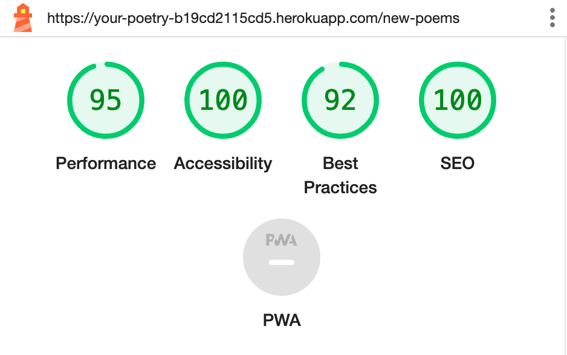
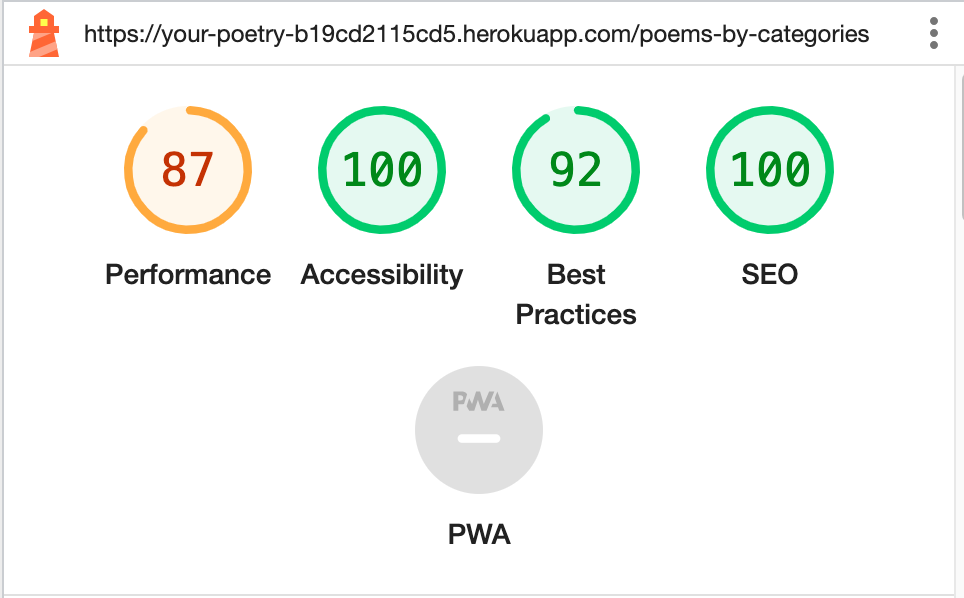
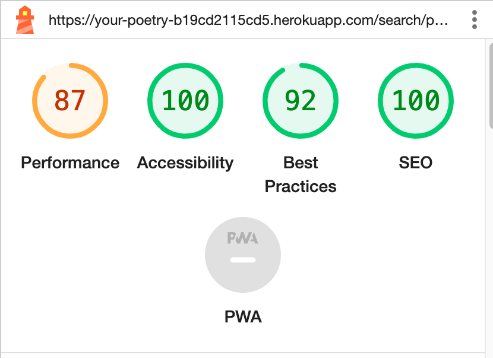

### New Poems

### Popular Poems

### Poems by Categories

### Search (poems)

### Search Profiles

### Contact

### Sign in

### Sign up

### My Profile

I wasn't able to check "My Poems", "Poets I'm following" and "Poems I liked".
When I go to these pages and click "Analyze the page load", the data didn't load and the error message was displayed.
(If I don't click 'analyze the page load', the pages load without any issues, and poems or profiles are displayed.)