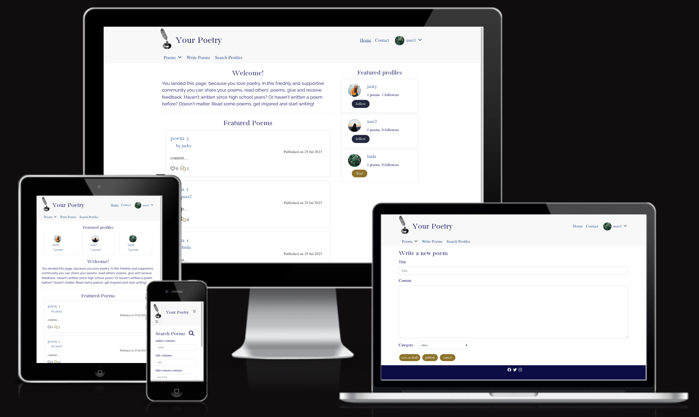
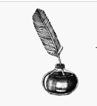
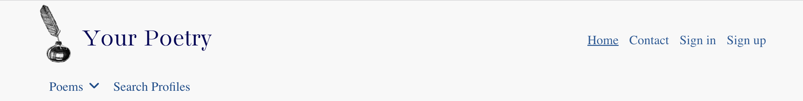
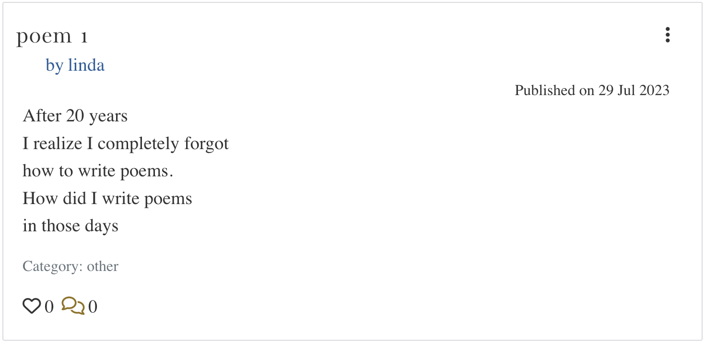
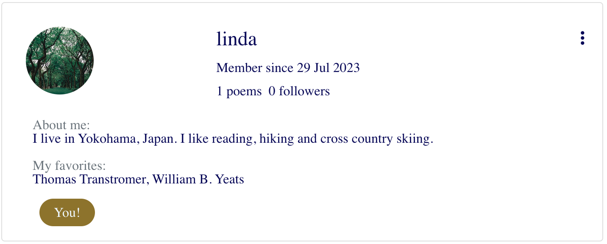
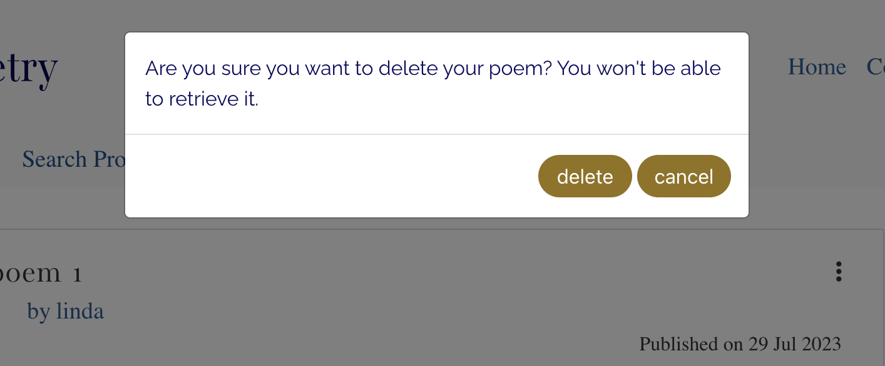

# Your Poetry

## CONTENTS

- [Overview](#overview)
- [User Stories](#user-stories)
- [Features in Nutshell](#features-in-a-nutshell)
- [Wireframes](#wireframes)
- [Notes on the Design](#notes-on-the-design)
- [Main Technologies Used](#main-technologies-used)
- [Each Part and Function in Detail](#each-part-and-function-in-detail)
- [Installed Libraries and Dependencies](#installed-libraries-and-dependencies)
- [Notes on Reuse of Components](#notes-on-reuse-of-components)
- [Deployment Process](#depoyment-process)
- [Manual Testing](#manual-testing)
- [Bugs](#bugs)
- [Performance and Accessibility](#performance-and-accessibility)
- [Validating CSS, Html code with Tools](#validating-css-html-code-with-tools)
- [Aspects to be improved in the future](#aspects-to-be-improved-in-the-future)
- [Media](#media)
- [Credits](#credits)

---

The app is deployed on Heroku and can be found [here](https://your-poetry-b19cd2115cd5.herokuapp.com).

## Overview

Your Poetry offers an interactive platform where users can share their poems and give/get comments on each other’s poems. The app is equipped with various features including liking/unliking poems, following/unfollowing profiles as well as searching poems/profiles. In addition users can also make their own profiles to let others know a few things about themselves. The purpose of the app is to offer users opportunities to be creative, to share their art and to inspire others.

## User Stories

User stories can be found [here](https://github.com/users/rkyzk/projects/6/views/1).

## Features in a Nutshell

In this app users can:

- Sign up for membership
- Sign in to have access to full features/sign out
- Edit one's own profile
- Write, update and delete poems
- Write, update and delete comments on poems
- Like/unlike poems
- Follow/unfollow profiles
- Look at various lists of poems such as recently published poems, popular poems, one's own poems and the poems they've liked
- Look at a list of profiles they've followed.
- Search poems and profiles

## Wireframes

Wireframes for this application can be found [here.](https://wireframe.cc/pro/pp/8521443d2672331)
Please click on "Homepage" in the upper left corner to see wireframes of different pages.

## Notes on the Design

**Fonts**

- For the website title and the headings of the pages, I used ‘Bacasime Antique.’
- For navigation links, labels for input boxes and the contents of poems, I used 'Nanum Myeongj.'
- I chose these two fonts because they both look artistic.
- For the introductory paragraph I used ‘Raleway’ since this font is readable and offers a friendly ambient.

**Colors**

Overall I wanted the website to appear simple, elegant and original. 
I used following colors in different sections:

- Background of navigation bars: light gray, #f8f8f8
- Text color: dark blue, rgb(51, 93, 151)
- Most buttons: olive, #8d7326;
- follow button: black, #242a3d
- unfollow button: rgb(189, 218, 243)
- Footer: dark blue, rgb(13, 13, 70)

I used dark blue for the text, instead of very commonly used black or dark gray in order to provide originality. 
I used light gray for the background of navigation bars to keep the appearance simple. 
I used olive color for most buttons, because the color provides a nice contrast to the dark blue. 

**Logo**

As the logo, I chose a drawing of a quill pen and ink, which suits the website's theme.

**Favicon**

I chose a feather icon for the favicon that looks like a quill pen, which is associated with poetry.

## Main Technologies Used

- HTML, CSS, JavaScript
- React.js
- Bootstrap.js

## Each Part and Function in Detail

**Logo**

- The logo is placed at the top left corner of the page, and it links to the home page.

**Navigation Bars**

_Navigation Bar at the top right_

- For logged out users the navigation bar displays links to “Home”, “Contact”, “Sign in” and “Sign out” pages.
- For logged in users, the avatar and the logged in user’s name are displayed in place of “Sign in” and “Sign up.”
- Clicking the username shows a dropdown menu for “My Profile”, “My Poems”, “Poets I’m following”, “Poems I like” and “Sign out”.
- I placed links to poems lists and a profile list that are specific to the current user in the top right dropdown menu. I placed links to other lists that are common to all users such as “New Poems” and “Popular poems” in the navigation bar on the left side.

_Navigation Bar at the top left_

- The second navigation bar is displayed on all pages except for sign in and sign up pages. (Users trying to sign in or sign up will not need this navigation bar.)
- For logged out users, a dropdown menu “Poems” and a link “Search Profiles” are displayed.
- For logged in users, the link to “Write Poems” will be displayed as well. This is hidden for logged out users because only logged in users can write poems.
- Clicking the dropdown menu “Poems” will show links to “New Poems”, “Popular Poems”, “Poems by Categories” and “Search” pages.

_Notes about both navigation bars_

- Both navigation bars will be replaced by burger menus for screen sizes below 768px.
- The names of all links clearly indicate what the destination pages are about, making it easy for users to navigate through the app.

**Footer**

- Footer has a dark blue color that matches the color of the text in the app to establish unity in the appearance.
- Footer offers links to facebook, twitter and Instagram pages.

**The Poem component**

- The poem component displays the title, the author, published date, excerpt (the first 60 characters of the content), likes count and comments count of the poem.
- Users can click the title to go to the individual poem page that displays the full content.
- On the individual poem page, if the user is the writer of the poem, three dots will appear at the top right corner of the component. Clicking the three dots will show options for editing and deleting the poem.
- Clicking the name of the author will redirect users to the profile page of the author.
- If users are logged in they can click the heart icon to like the poem. Clicking again will unlike the poem. The color of the heart is transparent if the user hasn’t liked the poem, and it will be pink otherwise.
- If the user is the writer of the poem, a tooltip will show up when the user hovers over the heart icon and says ‘You can’t like your own poem!’
- If users are not logged in, a tooltip will say ‘Log in to like poems!’ when they hover over the heart icon.
- Clicking the comment icon will redirect users to the individual poem page, so they can leave comments if they are logged in.

**The Profile component**

- The profile component displays the avatar, display name, the date joined, the number of poems written and number of followers. On the individual profile page, an introduction written by the owner (about_me) and their favorite poems and poets (‘favorites’ field) will be displayed as well.
- If users are logged in, follow/unfollow button will be displayed.
- If the user is the owner of the profile, a tag saying ‘You!’ will be displayed.

**Home**

- An introduction explains what the page is for and encourages users to become a member in a friendly and concise manner.
- Featured poems are presented right below the introduction.
- The editors of the site can select featured poems every week or 2 weeks or so and set the featured flag of the poems to true.
- It is important to present featured poems on “Home,” so editors can direct users to read well written poems when they land on the page, which will give them a good first impression of the site.
- Featured profiles are presented on the right column for large screen sizes. For screen sizes below 768px, the profiles are displayed at the top center.
- Every week (or at any time intervals) three featured profiles can be selected by editors of the page and set the featured flag of the profiles to true.

**Contact**

- Contact page provides the email address of the admin, so users can write to the owner of the site.

**New Poems**

- The page lists poems published in the previous 14 days.

**Popular Poems**

- The page lists poems published in the past 30 days ordered by descending likes count. (The poems with the highest number of likes will be displayed at the top.)

**Poems by Categories**

- Poems are categorized under different themes--nature, love, people, humor, haiku and other. Users can choose a category to get a list of poems in that category.

**Search Poems**

- Users can search poems by entering title, author, keyword, category and/or published date range.
- Title, author, keyword will search poems that contain the phrase entered by users (not exact match). The search is case insensitive.

**Write Poems**

- Logged in users can write new poems.
- The title and the content are required fields, and the category will be set ‘other’ unless the users select another category.
- If users try to submit a poem without either or both required fields, the validation message will tell the field may not be blank.
- Users can publish the poem, or save the draft without publishing it.
- All poems written by the user (including unpublished poems) can be found on “My Poems” page.

**Edit Poems**

- On the individual poems page, clicking the three dots and clicking the edit icon will redirect users to “Revise poems” page.
- The saved data for the title, content and category will be displayed on the page, and the user can update them.
- Clicking ‘cancel’ will abort editing and redirect users to the previous page.
- Clicking ‘save’ will save the changes.
- If the user hasn’t published the poem, ‘publish’ button will be displayed.

**Delete Poems (No page)**

- If users wish to delete their poem, they can click the three dots on the individual poem page and click the trash bin icon.
- A confirmation modal will be displayed, and the user can choose to delete or cancel.
- Deleting the poem will remove the data from the backend.

**Search Profiles**

- Users can enter a name of the profile and profiles that match will be displayed.
- The search will start to run one second after the user has stopped typing. (Otherwise the screen will keep flashing while users type letters.)
- The search will look for profiles with display names that contain the phrase entered by the users.
- The search is case insensitive.

**My Profile**

- The page displays the profile and the poems written by the user.
- Three dots will be displayed at the top right corner of the profile.
- Clicking on the three dots will show options to edit profile, to change username and to change password.

**Edit Profile**

- Users can update their display name, introduction about themselves, their favorite poems and poets as well as the profile image.
- Profile image has to be less than 800KB in size. The height and width need to be less than 1000px. Otherwise errors will be raised.

**Change username and password**

- In order to change the username or password, users can click the three dots on their profile page, select an option.
- They can enter their new username or password and save the data.

**My Poems**

- The page shows a list of poems written by the user.

**Poets I’m following**

- The page shows a list of profiles that the user is following.

**Poems I like**

- The page shows a list of poems the user has liked.

**Sign out (No page)**

- Clicking 'Sign out' from the dropdown menu will sing out the user.

## Installed Libraries and Dependencies

- react-bootstrap@1.6.3 bootstrap@4.6.0 were installed to make styling easier.
- react-router-dom@5.3.0 was installed to facilitate component-based routing.
- axios was installed as means to send requests to and get responses from the API.
- react-infinite-scroll-component was installed to implement infinite scroll functionality in displaying lists of poems and profiles.
- react-toastify@9.0.3 was installed to display feedback messages.
- jwt-decode was installed so that the timestamp within the response can be accessed.
  The timestamp for when the user logged in can be stored in the local storage, and this information is used to know if it’s appropriate to request a token refresh.

## Notes on Reuse of Components

Following components were used multiple times in the app.

| Components               | In which components, or on which pages are they used?                                    |
| :----------------------- | :--------------------------------------------------------------------------------------- |
| Asset.js                 | PoemPage.js, PoemsPage.js, FeaturedProfiles.js, ProfilePage.js, ProfilesPage.js          |
| Avatar.js                | Profile.js, NavBar.js, Comment.js, FeaturedProfiles.js                                   |
| FooterComponent.js       | Appears on all pages                                                                     |
| MoreDropdown.js          | Profile.js, Poem.js, Comment.js                                                          |
| NavBar.js                | Appears on all pages                                                                     |
| NavBarSecond.js          | Appears on all pages except for sign-in and sign-up pages                                |
| Comment.js               | PoemPage.js                                                                              |
| Poem.js                  | PoemPage.js, Poems.js, ProfilePage.js, Home.js, SearchPoems.js, PoemsPageWithProfiles.js |
| PoemsPage.js             | Home.js, PoemsPageWithProfiles.js, PoemsByCategories.js, SearchPoems.js, ProfilePage.js  |
| PoemsPageWithProfiles.js | NewPoems.js, PopularPoems.js                                                             |

## Depoyment Process

1. Remove ReactStrictMode components from index.js.
2. Make sure in package.json file, in the “scripts” section, the following prebuild command is written: 
   `"heroku-prebuild": "npm install -g serve",`
3. Add Procfile and write `web: serve -s build`
4. Create a new app on Heroku. On the Deploy tab, connect to this repository ‘your-poetry’ through Github.
5. At the bottom of the page, click ‘deploy branch’
6. After the app is successfully deployed, click “View” and get the URL of the app.
7. Go to Dashboard, select the app of the DRF API and open the Settings tab.
8. Add two Config Vars:

- CLIENT_DEV_ORIGIN = the URL of this app in development
- CLIENT_ORIGIN = the URL of the app deployed on Heroku. Deploy again the API project.

## Manual Testing

### Testing If Goals (User Stories) are achieved

| Test No. | Goals                                            | How they are achieved                                                                                                                                                                                                                                                                                                                                                                                                                                  |
| :------- | :----------------------------------------------- | :----------------------------------------------------------------------------------------------------------------------------------------------------------------------------------------------------------------------------------------------------------------------------------------------------------------------------------------------------------------------------------------------------------------------------------------------------- |
| 1        | The purpose and usage of the app are made clear. | On “Home” page, the introductory paragraph summarizes what users can do with the application. Also, navigation links are labeled clearly so it’s easy for users to grasp what they can do in this application.                                                                                                                                                                                                                                         |
| 2        | Clearly labeled navigation links                 | All navigation links are labeled with clear terms such as ‘Contact’ and ‘My poems.’                                                                                                                                                                                                                                                                                                                                                                    |
| 3        | Featued poems on the home page                   | Editors of the site can select featured poems, and those featured poems will be displayed on the home page.                                                                                                                                                                                                                                                                                                                                            |
| 4        | Lists of poems grouped by various criteria       | Besides “Featured poems” on “Home” page, the app offers following pages displaying various lists of poems. (1) New Poems: poems published in the previous 14 days (2) Popular Poems: poems with the highest number of likes are displayed at the top. (3) Poems by Categories: poems in six different categories can be found separately (4) My Poems: list of poems written by the logged in user (5) Poems I like: list of poems that the user liked |
| 5        | Signing up for membership                        | The link to the signup page is displayed in the navigation bar at the top right of all pages in the app. At the end of the introductory paragraph on “Home” page, visitors are invited to sign up, and the link to sign up page is provided.                                                                                                                                                                                                           |
| 6        | Writing and sharing poems                        | Users can write poems and save or publish their poems on “Write Poems” page. The link to the page is placed in the navigation bar at the top left for logged in users.                                                                                                                                                                                                                                                                                 |
| 7        | Updating poems                                   | In order to update a poem, users can go to “My Poems” page, click the title of the poem they want to edit, click the three dots that appear on the top right of their poem and click the edit icon.                                                                                                                                                                                                                                                    |
| 8        | Deleting poems                                   | To delete a poem, users should go to “My Poems” page, click the title of the poem they want to delete, click the three dots that appear on the top right of their poem, click the trash bin icon and click “delete” in the confirmation dialog.                                                                                                                                                                                                        |
| 9        | Posting comments on poems                        | Comment form is displayed below each poem if the user is logged in. They can enter their comment and click ‘post.’                                                                                                                                                                                                                                                                                                                                     |
| 10       | Editing and deleting comments                    | Users can edit or delete their comments by clicking the three dots that appear on the right side of their comments.                                                                                                                                                                                                                                                                                                                                    |
| 11       | Liking poems                                     | Logged in users can like others’ poems by clicking the heart icon.                                                                                                                                                                                                                                                                                                                                                                                     |
| 12       | Following users                                  | Logged in users can follow other members by clicking ‘follow’ button that appear at the bottom part of their profile.                                                                                                                                                                                                                                                                                                                                  |
| 13       | Profile Pages                                    | Registered users can update their profiles to introduce themselves to other members. Users can look at other members’ profiles to get to know about them.                                                                                                                                                                                                                                                                                              |
| 14       | Restricting access where appropriate             | Edit and delete buttons are displayed only for the owner of the poems and comments. If users try to get to the Poem Edit pages of others' poems by entering the URL "/poems/:id/edit, they will be redirected to "Home" by the code in line 49 in PoemEditForm.js.                                                                                                                                                                                     |
| 15       | Searching Poems                                  | On “Search Poems” page, users can search poems by author, title of the poems, keywords, categories and published date ranges.                                                                                                                                                                                                                                                                                                                          |
| 16       | Searching profiles                               | On “Search Profiles” page users can search profiles by entering display names.                                                                                                                                                                                                                                                                                                                                                                         |

### Testing Features

If logging in is necessary, log in with username: admin, password: superuser, unless specified otherwise.

#### Navigation Bar

**Overall responsiveness**

| Test No. | Feature being tested                 | Preparation Steps if any | Test Steps                                                                                                                                                    | Expected results                            | Actual results                              | Pass/Fail | Image                                                                                                                                      | Date      |
| :------- | :----------------------------------- | :----------------------- | :------------------------------------------------------------------------------------------------------------------------------------------------------------ | :------------------------------------------ | :------------------------------------------ | :-------- | :----------------------------------------------------------------------------------------------------------------------------------------- | :-------- |
| 1        | responsiveness of nav bar components | Go to “Home” page        | Expand the screen to the max width of the device(1350px) and gradually narrow down to 330px while checking all elements are displayed without any distortion. | All elements appear without any distortion. | All elements appear without any distortion. | pass      | [image1 ](./images/NavBarElements/1-1.png)[image2 ](./images/manual-tests/NavBarElements/1-2.png)[image3](./images/NavBarElements/1-3.png) | 2023/7/28 |

**Logo**

| Test No. | Feature being tested | Preparation Steps if any | Test Steps     | Expected results            | Actual results              | Pass/Fail | Image                                                   | Date      |
| :------- | :------------------- | :----------------------- | :------------- | :-------------------------- | :-------------------------- | :-------- | :------------------------------------------------------ | :-------- |
| 2        | Logo link            | Go to “Contact” page     | Click the logo | Redirected to the home page | Redirected to the home page | pass      | [image1 ](./images/NavBarElements/manual-tests/2&3.png) | 2023/7/23 |

**Navigation bar elements (Top right)**

| Test No. | Feature being tested                                | Preparation Steps if any                  | Test Steps                                                                         | Expected results                                                         | Actual results                                                           | Pass/Fail | Image                                                 | Date      |
| :------- | :-------------------------------------------------- | :---------------------------------------- | :--------------------------------------------------------------------------------- | :----------------------------------------------------------------------- | :----------------------------------------------------------------------- | :-------- | :---------------------------------------------------- | :-------- |
| 3        | Nav bar elements when logged out                    | Log out                                   | Check if the only links displayed are “Home,” “Contact,” “Sign in” and “Sign out”. | The only links displayed are “Home,” “Contact,” “Sign in” and “Sign out” | The only links displayed are “Home,” “Contact,” “Sign in” and “Sign out” | pass      | [image](./images/manual-tests/NavBarElements/2&3.png) | 2023/7/23 |
| 4        | link to ”Home”                                      | Go to “Contact” page                      | Click “Home”                                                                       | Redirected to ”Home"                                                     | Redirected to ”Home”                                                     | pass      | [image](./images/manual-tests/NavBarElements/4.png)   | 2023/7/23 |
| 5        | link to ”Contact”                                   | Go to “Home”                              | Click “Contact”                                                                    | Redirected to ”Contact”                                                  | Redirected to ”Contact”                                                  | pass      | [image](./images/manual-tests/NavBarElements/5.png)   | 2023/7/23 |
| 6        | link to ”Sign in”                                   | Log out if you haven't. Go to “Home” page | Click “Sign in”                                                                    | Redirected to ”Sign in”                                                  | Redirected to “Sign in”                                                  | pass      | [image](./images/manual-tests/NavBarElements/6.png)   | 2023/7/23 |
| 7        | link to ”Sign up”                                   | Go to “Home” page                         | Click “Sign up”                                                                    | Redirected to ”Sign up”                                                  | Redirected to “Sign up”                                                  | pass      | [image](./images/manual-tests/NavBarElements/7.png)   | 2023/7/23 |
| 8        | burger menu                                         | --                                        | Narrow down the screen width and check a burger menu appears at 767px.             | A burger menu appears at 767px or below.                                 | A burger menu appears at 767px or below.                                 | pass      | [image](./images/manual-tests/NavBarElements/8.png)   | 2023/7/23 |
| 9        | burger menu opens when clicked                      | --                                        | Click the burger menu.                                                             | A menu with 'Home', 'Contact', 'Sign in' and 'Sign out' appears.         | A menu with 'Home', 'Contact', 'Sign in' and 'Sign out' appears.         | pass      | [image](./images/manual-tests/NavBarElements/9.png)   | 2023/7/23 |
| 10       | Burger menu closes when a link is clicked           | --                                        | Click the burger menu and click 'Home'.                                            | The burger menu closes.                                                  | The burger menu closes.                                                  | pass      | [image](./images/manual-tests/NavBarElements/10.png)  | 2023/7/23 |
| 11       | Burger menu closes when outside the menu is clicked | --                                        | Click the burger menu and click outside the menu.                                  | The burger menu closes.                                                  | The burger menu closes.                                                  | pass      | [image](./images/manual-tests/NavBarElements/11.png)  | 2023/7/23 |
| 12       | link "Home" in burger menu functions                | Go to "Contact"                           | Click the burger menu and click 'Home'.                                            | Redirected to 'Home.'                                                    | Redirected to 'Home.'                                                    | pass      | [image](./images/manual-tests/NavBarElements/12.png)  | 2023/7/23 |
| 13       | link 'Contact' in burger menu functions             | Go to "Home"                              | Click the burger menu and click 'Contact'.                                         | Redirected to 'Contact.'                                                 | Redirected to 'Contact.'                                                 | pass      | [image](./images/manual-tests/NavBarElements/13.png)  | 2023/7/23 |
| 14       | link 'Sign in; in burger menu functions             | --                                        | Click the burger menu and click 'Sign in'.                                         | Redirected to 'Sign in.'                                                 | Redirected to 'Sign in.'                                                 | pass      | [image](./images/manual-tests/NavBarElements/14.png)  | 2023/7/23 |
| 15       | link 'Sign up' burger menu functions                | --                                        | Click the burger menu and click 'Sign up'.                                         | Redirected to 'Sign up.'                                                 | Redirected to 'Sign up.'                                                 | pass      | [image](./images/manual-tests/NavBarElements/15.png)  | 2023/7/23 |

- For the following tests, sign in with username: admin, password: superuser 

| Test No. | Feature being tested                                       | Preparation Steps if any                    | Test Steps                                                                     | Expected results                                                       | Actual results                                                         | Pass/Fail | Image                                                | Date     |
| :------- | :--------------------------------------------------------- | :------------------------------------------ | :----------------------------------------------------------------------------- | :--------------------------------------------------------------------- | :--------------------------------------------------------------------- | :-------- | :--------------------------------------------------- | :------- |
| 16       | displayed items                                            | --                                          | Check links 'Home', 'Contact,' an avatar and username 'admin' are displayed.   | Links 'Home', 'Contact,' an avatar and username 'admin' are displayed. | Links 'Home', 'Contact,' an avatar and username 'admin' are displayed. | pass      | [image](./images/manual-tests/NavBarElements/16.png) | 2023/8/6 |
| 17       | dropdown menu                                              | --                                          | Click username “admin”                                                         | The drowdown menu is displayed.                                        | The drowdown menu is displayed.                                        | pass      | [image](./images/manual-tests/NavBarElements/17.png) | 2023/8/6 |
| 18       | ”My Profile”                                               | Click username “admin”                      | Click “My Profile”                                                             | Redirected to ”My Profile” of admin                                    | Redirected to “My Profile” of admin                                    | pass      | [image](./images/manual-tests/NavBarElements/18.png) | 2023/8/6 |
| 19       | ”My Poems”                                                 | Click username “admin”                      | Click “My Poems”                                                               | Redirected to ”My Poems” of admin                                      | Redirected to “My Poems” of admin                                      | pass      | [image](./images/manual-tests/NavBarElements/19.png) | 2023/8/6 |
| 20       | ”Poets I’m following”                                      | Click username “admin”                      | Click “Poets I’m following”                                                    | Redirected to ”Poets I’m following”                                    | Redirected to “Poets I’m following”                                    | pass      | [image](./images/manual-tests/NavBarElements/20.png) | 2023/8/6 |
| 21       | ”Poems I like”                                             | Click username “admin”                      | Click “Poems I like”                                                           | Redirected to ”Poems I like”                                           | Redirected to “Poems I like”                                           | pass      | [image](./images/manual-tests/NavBarElements/21.png) | 2023/8/6 |
| 22       | ”Sign out”                                                 | Click username “admin”                      | Click “Sign out”                                                               | Notification “You’ve been signed out” appears. Redirected to ”Home”    | Notification “You’ve been signed out” appears. Redirected to ”Home”    | pass      | [image](./images/manual-tests/NavBarElements/22.png) | 2023/8/6 |
| 23       | Avatar is absent in the burger menu                        | Log in. Narrow down the screen below 767px. | Click the burger menu and check the avatar in front of the username is absent. | The avatar is absent.                                                  | The avatar is absent.                                                  | pass      | [image](./images/manual-tests/NavBarElements/23.png) | 2023/8/6 |
| 24       | The second dropdown in the burger menu opens when clicked. | --                                          | Click the burger menu and "admin"                                              | The burger menu opens                                                  | The burger menu opens                                                  | pass      | [image](./images/manual-tests/NavBarElements/24.png) | 2023/8/6 |
| 25       | both menus close when a link is clicked.                   | --                                          | Click the burger menu, "admin" and "My Profile"                                | The burger menu closes                                                 | The burger menu closes                                                 | pass      | [image](./images/manual-tests/NavBarElements/25.png) | 2023/8/6 |
| 26       | both burger menus close if outside the menu is clicked.    | --                                          | Click the burger menu, "admin" and click outside the menu.                     | The menus close.                                                       | The menus close.                                                       | pass      | [image](./images/manual-tests/NavBarElements/26.png) | 2023/8/6 |
| 27       | Link ”My Profile” in the burger menu                       | --                                          | Click the burger menu, "admin" and “My Profile”                                | Redirected to ”My Profile” of admin                                    | Redirected to “My Profile” of admin                                    | pass      | [image](./images/manual-tests/NavBarElements/27.png) | 2023/8/6 |
| 28       | Link ”My Poems” in the burger menu                         | --                                          | Click the burger menu, "admin" and “My Poems”                                  | Redirected to ”My Poems” of admin                                      | Redirected to “My Poems” of admin                                      | pass      | [image](./images/manual-tests/NavBarElements/28.png) | 2023/8/6 |
| 29       | Link ”Poets I’m following” in the burger menu              | --                                          | Click the burger menu, "admin" and "Poets I'm following"                       | Redirected to ”Poets I’m following”                                    | Redirected to “Poets I’m following”                                    | pass      | [image](./images/manual-tests/NavBarElements/29.png) | 2023/8/6 |
| 30       | Link ”Poems I like” in the burger menu                     | --                                          | Click the burger menu, "admin" and “Poems I like”                              | Redirected to ”Poems I like”                                           | Redirected to “Poems I like”                                           | pass      | [image](./images/manual-tests/NavBarElements/30.png) | 2023/8/6 |
| 31       | ”Sign out” in the burger menu                              | --                                          | Click the burger menu, "admin" and “Sign out”                                  | Redirected to ”Home.” Notification “You’ve been signed out” appears.   | Redirected to ”Home.” Notification “You’ve been signed out” appears.   | pass      | [image](./images/manual-tests/NavBarElements/31.png) | 2023/8/6 |

**Navigation bar elements (Top left)**

| Test No. | Feature being tested                                     | Preparation Steps if any | Test Steps                                              | Expected results                                                  | Actual results                                                    | Pass/Fail | Image                                                | Date      |
| :------- | :------------------------------------------------------- | :----------------------- | :------------------------------------------------------ | :---------------------------------------------------------------- | :---------------------------------------------------------------- | :-------- | :--------------------------------------------------- | :-------- |
| 32       | displayed elements when logged out                       | Log out                  | Check which elements are displayed.                     | Links “Poems” and “Search Profiles” are displayed.                | Links “Poems” and “Search Profiles” are displayed.                | pass      | [image](./images/manual-tests/NavBarElements/32.png) | 2023/7/23 |
| 33       | displayed elements when logged in                        | Log in                   | Check which elements are displayed.                     | Links “Poems,” “Write Poems” and “Search Profiles” are displayed. | Links “Poems,” “Write Poems” and “Search Profiles” are displayed. | pass      | [image](./images/manual-tests/NavBarElements/33.png) | 2023/8/6  |
| 34       | dropdown menu                                            | --                       | Click “Poems”                                           | The dropdown menu is displayed.                                   | The dropdown menu is displayed.                                   | pass      | [image](./images/manual-tests/NavBarElements/34.png) | 2023/8/6  |
| 35       | dropdown closes if a link is clicked                     | click “Poems”            | Click “New Poems”                                       | The menu closes                                                   | The menu closes.                                                  | pass      | [image](./images/manual-tests/NavBarElements/34.png) | 2023/8/6  |
| 35       | dropdown closes if outside the menu is clicked           | click “Poems”            | Click outside the menu.                                 | The menu closes                                                   | The menu closes.                                                  | pass      | [image](./images/manual-tests/NavBarElements/35.png) | 2023/8/6  |
| 36       | Link ”New Poems”                                         | click “Poems”            | Click “New Poems”                                       | redirected to “New Poems” page.                                   | redirected to “New Poems” page.                                   | pass      | [image](./images/manual-tests/NavBarElements/36.png) | 2023/8/6  |
| 37       | Link ”Popular Poems”                                     | Click “Poems”            | Click “Popular Poems”                                   | Redirected to ”Popular Poems”                                     | Redirected to ”Popular Poems”                                     | pass      | [image](./images/manual-tests/NavBarElements/37.png) | 2023/8/6  |
| 38       | Link ”Poems by Categories”                               | Click “Poems”            | Click “Poems by Categories”                             | Redirected to ”Poems by Categories”                               | Redirected to ”Poems by Categories”                               | pass      | [image](./images/manual-tests/NavBarElements/38.png) | 2023/8/6  |
| 39       | Link ”Search”                                            | Click “Poems”            | Click “Search Poems”                                    | Redirected to ”Search” (poems)                                    | Redirected to ”Search” (poems)                                    | pass      | [image](./images/manual-tests/NavBarElements/39.png) | 2023/8/6  |
| 40       | Link ”Search Profiles”                                   | --                       | Click “Search Profiles”                                 | Redirected to ”Search Profiles”                                   | Redirected to “Search Profiles”                                   | pass      | [image](./images/manual-tests/NavBarElements/40.png) | 2023/7/23 |
| 41       | ”Write Poems”                                            | log in                   | Click “Write Poems”                                     | Redirected to ”Write Poems”                                       | Redirected to “Write Poems”                                       | pass      | [image](./images/manual-tests/NavBarElements/41.png) | 2023/7/23 |
| 42       | responsiveness                                           | Log out                  | Narrow down the screen to 767px.                        | A burger menu appears.                                            | A burger menu appears.                                            | pass      | [image](./images/manual-tests/NavBarElements/42.png) | 2023/7/28 |
| 43       | The burger menu opens when clicked.                      | --                       | Click the burger menu.                                  | A burger menu appears.                                            | A burger menu appears.                                            | pass      | [image](./images/manual-tests/NavBarElements/43.png) | 2023/7/28 |
| 44       | The burger menu closes when a link is clicked.           | --                       | Click the burger menu and click "Search Profiles."      | A burger menu closes.                                             | A burger menu closes.                                             | pass      | [image](./images/manual-tests/NavBarElements/44.png) | 2023/7/28 |
| 45       | The burger menu closes when outside the menu is clicked. | --                       | Click the burger menu and click outside the menu.       | A burger menu closes.                                             | A burger menu closes.                                             | pass      | [image](./images/manual-tests/NavBarElements/45.png) | 2023/7/28 |
| 46       | Link "New Poems" in the burger menu                      | --                       | Click the burger menu > 'Poems' > 'New Poems'           | Redirected to 'New Poems'                                         | Redirected to 'New Poems'                                         | pass      | [image](./images/manual-tests/NavBarElements/46.png) | 2023/8/6  |
| 47       | Link "Popular Poems" in the burger menu                  | --                       | Click the burger menu > 'Poems' > 'Popular Poems'       | Redirected to 'Popular Poems'                                     | Redirected to 'Popular Poems'                                     | pass      | [image](./images/manual-tests/NavBarElements/47.png) | 2023/8/6  |
| 48       | Link "Poems by Categories" in the burger menu            | --                       | Click the burger menu > 'Poems' > 'Poems by Categories' | Redirected to 'Poems by Categories'                               | Redirected to 'Poems by Categories'                               | pass      | [image](./images/manual-tests/NavBarElements/48.png) | 2023/8/6  |
| 49       | Link "Search" in the burger menu                         | --                       | Click the burger menu > 'Poems' > 'Search'              | Redirected to 'Search' (poems)                                    | Redirected to 'Search' (poems)                                    | pass      | [image](./images/manual-tests/NavBarElements/49.png) | 2023/8/6  |
| 50       | Link "Search Profiles" in the burger menu                | --                       | Click the burger menu > 'Search Profiles'               | Redirected to 'Search Profiles'                                   | Redirected to 'Search Profiles'                                   | pass      | [image](./images/manual-tests/NavBarElements/50.png) | 2023/8/6  |
| 51       | Link "Write poems" in the burger menu                    | log in                   | Click the burger menu > 'Write Poems'                   | Redirected to 'Write Poems'                                       | Redirected to 'Write Poems'                                       | pass      | [image](./images/manual-tests/NavBarElements/51.png) | 2023/8/6  |

#### Footer

| Test No. | Feature             | Preparation Steps if any | Test Steps                                                                                                                                                                      | Expected results                                   | Actual results                                     | Pass/Fail | Image                                       | Date      |
| :------- | :------------------ | :----------------------- | :------------------------------------------------------------------------------------------------------------------------------------------------------------------------------ | :------------------------------------------------- | :------------------------------------------------- | :-------- | :------------------------------------------ | :-------- |
| 1        | Displayed elements  |                          | Check facebook, twitter and instagram icons are displayed.                                                                                                                      | The three icons are displayed.                     | The three icons are displayed.                     | pass      | [image](./images/manual-tests/Footer/1.png) | 2023/7/28 |
| 2        | responsiveness      | --                       | Expand the screen to 1350px (max width on the device used for testing). Narrow down the screen size to 330px, while checking the elements are displayed without any distortion. | The elements are displayed without any distortion. | The elements are displayed without any distortion. | pass      | [image](./images/manual-tests/Footer/2.png) | 2023/7/28 |
| 3        | link to ”facebook”  | —                        | Click the link                                                                                                                                                                  | Redirected to facebook website                     | Redirected to facebook website                     | pass      | [image](./images/manual-tests/Footer/3.png) | 2023/7/28 |
| 4        | link to ”twitter”   | —                        | Click the link                                                                                                                                                                  | Redirected to twitter website                      | Redirected to twitter website                      | pass      | [image](./images/manual-tests/Footer/4.png) | 2023/7/28 |
| 5        | link to ”instagram” | —                        | Click the link                                                                                                                                                                  | Redirected to instagram website                    | Redirected to instagram website                    | pass      | [image](./images/manual-tests/Footer/5.png) | 2023/7/28 |

#### Sign in page 

Stay logged out for tests no. 1-12.

| Test No. | Feature                                                  | Preparation Steps if any | Test Steps                                                                                                                                                                                    | Expected results                                                      | Actual results                                                     | Pass/Fail | Image                                        | Date      |
| :------- | :------------------------------------------------------- | :----------------------- | :-------------------------------------------------------------------------------------------------------------------------------------------------------------------------------------------- | :-------------------------------------------------------------------- | :----------------------------------------------------------------- | :-------- | :------------------------------------------- | :-------- |
| 1        | displayed elements                                       | —                        | Check the navbar on top right is present but the one on the left side is not. Check the heading, input box for username and password, the sign in button, link to sign up page are displayed. | All mentioned elements are displayed.                                 | All mentioned elements are displayed.                              | pass      | [image](./images/manual-tests/Signin/1.png)  | 2023/7/23 |
| 2        | sign in function                                         | —                        | enter ‘admin’ for username and ‘superuser’ for password. Click ‘Sign in’                                                                                                                      | Redirected to “Home.” Message "You're signed in as admin" appears.    | Redirected to “Home.” Message "You're signed in as admin" appears. | pass      | [image](./images/manual-tests/Signin/2.png)  | 2023/7/23 |
| 3        | validation for name field                                | —                        | enter nothing for username and ‘superuser’ for password. Click ‘Sign in’                                                                                                                      | validation message says required fields must be filled out.           | validation message says “Must include "username" and "password".   | pass      | [image](./images/manual-tests/Signin/3.png)  | 2023/7/23 |
| 4        | validation for password field                            | —                        | enter admin for username and nothing for password. Click ‘Sign in’                                                                                                                            | validation message says required fields must be filled out.           | validation message says “The field may not be blank.”              | pass      | [image](./images/manual-tests/Signin/4.png)  | 2023/7/23 |
| 5        | validation for username and pasword fields               | —                        | enter nothing for both username and password. Click ‘Sign in’                                                                                                                                 | validation message says required fields must be filled out.           | Validation message says “This field may not be blank.”             | pass      | [image](./images/manual-tests/Signin/5.png)  | 2023/7/23 |
| 6        | Validation in case spaces are entered in required fields | —                        | enter one space for both username and password. Click ‘Sign in’                                                                                                                               | validation message says required fields must be filled out.           | Validation message says “This field may not be blank.”             | pass      | [image](./images/manual-tests/Signin/6.png)  | 2023/7/23 |
| 7        | validation in case of a wrong password                   | —                        | enter admin for username. Enter ‘wrong’ for password. Click ‘Sign in’                                                                                                                         | Validation message says either the username or the password is wrong. | Validation says “Unable to log in with provided credentials.”      | pass      | [image](./images/manual-tests/Signin/7.png)  | 2023/7/23 |
| 8        | validation when the username is non existent             | —                        | enter ‘test’ for username. enter ‘superuser’ for password. Click ‘Sign in’                                                                                                                    | Validation message says either the username or the password is wrong. | Validation says “Unable to log in with provided credentials.”      | pass      | [image](./images/manual-tests/Signin/8.png)  | 2023/7/23 |
| 9        | validation: case sensitivity for the username            | —                        | enter ‘Admin’ for username and ‘superuser’ for password. Click ‘Sign in’                                                                                                                      | Validation message says either the username or the password is wrong. | Validation says “Unable to log in with provided credentials.”      | pass      | [image](./images/manual-tests/Signin/9.png)  | 2023/7/23 |
| 10       | validation: case sensitivity for the password            | —                        | enter ‘admin’ for username and ‘Superuser’ for password. Click ‘Sign in’                                                                                                                      | Validation message says either the username or the password is wrong. | Validation says “Unable to log in with provided credentials.”      | pass      | [image](./images/manual-tests/Signin/10.png) | 2023/7/23 |
| 11       | link to sign up page                                     | —                        | Click the link “Don’t have an account? Sign up now!”                                                                                                                                          | Redirected to “Sign up”                                               | Redirected to “Sign up”                                            | pass      | [image](./images/manual-tests/Signin/11.png) | 2023/7/23 |
| 12       | responsiveness                                           | —                        | Expand the screen to 1350px, and gradually norrow it down to 330px, while checking if all elements appear without any distortion.                                                             | All elements appear without any distortion.                           | All elements appear without any distortion.                        | pass      | [image](./images/manual-tests/Signin/12.png) | 2023/7/28 |
| 13       | user redirect                                            | —                        | Log in and enter "/signin" in the URL                                                                                                                                                         | Redirected to "Home."                                                 | Sign in appears for a moment and then redirected to "Home."        | pass      | [image](./images/manual-tests/Signin/13.png) | 2023/7/28 |

#### Sign up

Stay logged out for tests no. 1-7 

| Test No. | Feature                            | Preparation Steps if any | Test Steps                                                                                                                                                                | Expected results                                    | Actual results                                                                       | Pass/Fail | Image                                                                                         | Date      |
| :------- | :--------------------------------- | :----------------------- | :------------------------------------------------------------------------------------------------------------------------------------------------------------------------ | :-------------------------------------------------- | :----------------------------------------------------------------------------------- | :-------- | :-------------------------------------------------------------------------------------------- | :-------- |
| 1        | displayed elements                 | —                        | Check that the first nav bar on top right, the heading, input boxes for username, password and confirm password, sign up button and the link to signin page are displayed | All elements are displayed.                         | All elements are displayed.                                                          | pass      | [image](./images/manual-tests/Signup/1.png)                                                   | 2023/7/23 |
| 2        | sign up function                   | —                        | enter ‘user4’ for username and ‘swUf8LcR’ for both password fields. Click ‘Sign up’                                                                                       | Redirected to “Sign in Page.”                       | Redirected to “Sign in Page.” In the backend, profile with owner 'user4' is present. | pass      | [image1 ](./images/manual-tests/Signup/2-1.png)[image2](./images/manual-tests/Signup/2-2.png) | 2023/7/23 |
| 3        | validation (username)              | —                        | enter nothing for username. Enter ‘swUf8LcR’ for password fields. Click ‘Sign up’                                                                                         | Validation says required fields must be filled out. | Validation says "This field may not be blank."                                       | pass      | [image](./images/manual-tests/Signup/3.png)                                                   | 2023/7/23 |
| 4        | validation (first password field)  | —                        | enter ‘user5’ for username. Leave the first password field, and enter ‘swUf8LcR’ for the second password field. Click ‘Sign up’                                           | Validation says required fields must be filled out. | Validation says "This field may not be blank." for the first password field.         | pass      | [image](./images/manual-tests/Signup/4.png)                                                   | 2023/7/23 |
| 5        | validation (second password field) | —                        | enter ‘user5’ for username. Enter ‘swUf8LcR’ for the first password field, and leave the second password field. Click ‘Sign up’                                           | Validation says required fields must be filled out. | Validation says "This field may not be blank." for the second password field.        | pass      | [image](./images/manual-tests/Signup/5.png)                                                   | 2023/7/23 |
| 6        | validation (all fields)            | —                        | Leave all fields blank. Click ‘Sign up’                                                                                                                                   | Validation says required fields must be filled out. | Validation says "This field may not be blank" for all three fields                   | pass      | [image](./images/manual-tests/Signup/6.png)                                                   | 2023/7/23 |
| 7        | validation (spaces)                | —                        | Enter one space in each field. Click ‘Sign up’                                                                                                                            | Validation says required fields must be filled out. | Validation says "This field may not be blank" for all three fields.                  | pass      | [image](./images/manual-tests/Signup/7.png)                                                   | 2023/7/23 |
| 8        | validation (common password)       | —                        | Enter “user5” for username and “password” for both password fields. Click ‘Sign up’                                                                                       | Validation says the password is too common.         | Validation says "This password is too common."                                       | pass      | [image](./images/manual-tests/Signup/8.png)                                                   | 2023/7/23 |
| 9        | link to sign in page               | -                        | Click the link "Already have an account? Sign in"                                                                                                                         | Redirected to "Sign in"                             | Redirected to "Sign in"                                                              | pass      | [image](./images/manual-tests/Signup/9.png)                                                   | 2023/7/23 |
| 10       | responsiveness                     | —                        | Expand the screen to 1350px, and gradually norrow it down to 330px, while checking if all elements appear without any distortion.                                         | All elements appear without any distortion.         | All elements appear without any distortion.                                          | pass      | [image](./images/manual-tests/Signup/10.png)                                                  | 2023/7/28 |
| 11       | user redirect                      | —                        | Log in and enter "/signup" in the URL                                                                                                                                     | Redirected to "Home."                               | Signup page appears for a moment and then redirected to "Home."                      | pass      | [image](./images/manual-tests/Signup/11.png)                                                  | 2023/7/28 |

#### Home page

- For test no. 5, go to admin panel, make poems titled 'poem1', 'poem2', 'poem3' (content: 'content'; category: 'other') and set the featured_flag to true

| Test No. | Feature                                      | Preparation Steps if any | Test Steps                                                                                                                        | Expected results                            | Actual results                              | Pass/Fail | Images                                                                                    | Date      |
| :------- | :------------------------------------------- | :----------------------- | :-------------------------------------------------------------------------------------------------------------------------------- | :------------------------------------------ | :------------------------------------------ | :-------- | :---------------------------------------------------------------------------------------- | :-------- |
| 1        | Displayed elements.                          | log out                  | Check both navbars, introduction, the sentence "Don't have an account...", featured poems, featured profiles are displayed.       | All mentioned elements are displayed.       | All mentioned elements are displayed.       | pass      | [image](./images/manual-tests/Home/1.png)                                                 | 2023/7/28 |
| 2        | Displayed elements.                          | log in                   | Check that the sentence "Don't have an account..." is not displayed.                                                              | The sentence is not displayed.              | The sentence is not displayed.              | Hopass    | [image](./images/manual-tests/Home/2.png)                                                 | 2023/7/28 |
| 3        | responsiveness                               | —                        | Expand the screen to 1350px, and gradually norrow it down to 330px, while checking if all elements appear without any distortion. | All elements appear without any distortion. | All elements appear without any distortion. | pass      | [image](./images/manual-tests/Home/3.png)                                                 | 2023/7/28 |
| 4        | link to signup page                          | log out.                 | Click the link.                                                                                                                   | Redirected to signup page.                  | Redirected to signup page.                  | pass      | [image](./images/manual-tests/Home/4.png)                                                 | 2023/7/28 |
| 5        | Correct poems are filtered as featured poems |                          | Check if 'poem 3', 'poem2', 'poem1' are displayed.                                                                                | 'poem 3', 'poem2', 'poem1' are displayed.   | 'poem 3', 'poem2', 'poem1' are displayed.   | pass      | [image1 ](./images/manual-tests/Home/5-1.png)[image2](./images/manual-tests/Home/5-2.png) | 2023/7/29 |

#### Contact Page

| Test No. | Feature             | Preparation Steps if any | Test Steps                                                                                                                        | Expected results                            | Actual results                              | Pass/Fail | image                                        | Date      |
| :------- | :------------------ | :----------------------- | :-------------------------------------------------------------------------------------------------------------------------------- | :------------------------------------------ | :------------------------------------------ | :-------- | :------------------------------------------- | :-------- |
| 1        | Displayed elements. | Click "Contact"          | Check if the heading and the right content is displayed.                                                                          | All mentioned elements are displayed.       | All mentioned elements are displayed.       | pass      | [image](./images/manual-tests/Contact/1.png) | 2023/7/23 |
| 2        | responsiveness      | —                        | Expand the screen to 1350px, and gradually norrow it down to 330px, while checking if all elements appear without any distortion. | All elements appear without any distortion. | All elements appear without any distortion. | pass      | [image](./images/manual-tests/Contact/2.png) | 2023/7/28 |

#### Write poems

| Test No. | Feature                | Preparation Steps if any             | Test Steps                                                                                                                                 | Expected results                                                                                                                              | Actual results                                                                                                                              | Pass/Fail | image                                                                                                 | Date      |
| :------- | :--------------------- | :----------------------------------- | :----------------------------------------------------------------------------------------------------------------------------------------- | :-------------------------------------------------------------------------------------------------------------------------------------------- | :------------------------------------------------------------------------------------------------------------------------------------------ | :-------- | :---------------------------------------------------------------------------------------------------- | :-------- |
| 1        | Displayed elements.    | --                                   | Check if the heading, input boxes for title, content, select box for category, 'save as draft,' 'publish,' 'cancel' buttons are displayed. | All mentioned elements are displayed.                                                                                                         | All mentioned elements are displayed.                                                                                                       | pass      | [image](./images/manual-tests/WritePoems/1.png)                                                       | 2023/7/28 |
| 2        | responsiveness         | —                                    | Expand the screen to 1350px, and gradually norrow it down to 330px, while checking if all elements appear without any distortion.          | All elements appear without any distortion.                                                                                                   | All elements appear without any distortion.                                                                                                 | pass      | [image](./images/manual-tests/WritePoems/2.png)                                                       | 2023/7/28 |
| 3        | Save poem              | —                                    | Enter title: 'test'; content: content; category: 'other' and click 'save.'                                                                 | Message "Your poem has been saved.' appears. Redirected to the poem page of the new poem. The poem is labeled 'Not published yet.'            | Message "Your poem has been saved.' appears. Redirected to the poem page of the new poem. The poem is labeled 'Not published yet.'          | pass      | [image1 ](./images/manual-tests/WritePoems/3-1.png)[image2](./images/manual-tests/WritePoems/3-2.png) | 2023/7/28 |
| 4        | Publish poem           | —                                    | Enter title: 'test2'; content: content; category: 'other' and click 'publish.'                                                             | Message "Your poem has been published.' appears. Redirected to the poem page of the new poem. The poem is labeled "Published on 28 Jul 2023." | Message "Your poem has been published.' appears. Redirected to the poem page of the new poem.The poem is labeled "Published on 28 Jul 2023" | pass      | [image1 ](./images/manual-tests/WritePoems/4-1.png)[image2](./images/manual-tests/WritePoems/4-2.png) | 2023/7/28 |
| 5        | category               | —                                    | Enter title: 'test3'; content: content; category: 'nature' and click 'save.' Check on the poem page that category is labeled 'nature.'     | Category is labeled 'nature.'                                                                                                                 | Category is labeled 'nature.'                                                                                                               | pass      | [image1 ](./images/manual-tests/WritePoems/5-1.png)[image2](./images/manual-tests/WritePoems/5-2.png) | 2023/7/28 |
| 6        | Validation for title   | —                                    | Leave title empty. Enter content: content; category: 'other' and click 'publish.'                                                          | Validation says the field is required.                                                                                                        | Validation says 'This field may not be blank.'                                                                                              | pass      | [image ](./images/manual-tests/WritePoems/6.png)                                                      | 2023/7/28 |
| 7        | Validation for content | —                                    | Enter title: test, category: other; leave content empty and click 'publish.'                                                               | Validation says the field is required.                                                                                                        | Validation says 'This field may not be blank.'                                                                                              | pass      | [image ](./images/manual-tests/WritePoems/7.png)                                                      | 2023/7/28 |
| 8        | cancel                 | Go to "Home" and click "Write Poems" | Enter title: 'test'; and click 'cancel.'                                                                                                   | Redirected to "Home"                                                                                                                          | Redirected to "Home"                                                                                                                        | pass      | [image ](./images/manual-tests/WritePoems/8.png)                                                      | 2023/7/28 |
| 9        | user redirect          | —                                    | Log out and go to "/poems/create"                                                                                                          | Redirected to "Home."                                                                                                                         | Redirected to "Home."                                                                                                                       | pass      | [image ](./images/manual-tests/WritePoems/9.png)                                                      | 2023/7/28 |

#### Edit poems

Go to "/poems/27/edit," which is the edit page for the poem 'test' written in test no. 3 in the previous 'Write poems' section. 

| Test No. | Feature                                 | Preparation Steps if any | Test Steps                                                                                                                        | Expected results                                                                                       | Actual results                                                                                         | Pass/Fail | image                                                                                               | Date      |
| :------- | :-------------------------------------- | :----------------------- | :-------------------------------------------------------------------------------------------------------------------------------- | :----------------------------------------------------------------------------------------------------- | :----------------------------------------------------------------------------------------------------- | :-------- | :-------------------------------------------------------------------------------------------------- | :-------- |
| 1        | Displayed elements.                     |                          | Check if the heading, input boxes for title, content, select box for category, 'save,' 'publish,' 'cancel' buttons are displayed. | All mentioned elements are displayed.                                                                  | All mentioned elements are displayed.                                                                  | pass      | [image](./images/manual-tests/EditPoems/1.png)                                                      | 2023/7/28 |
| 2        | responsiveness                          | —                        | Expand the screen to 1350px, and gradually norrow it down to 330px, while checking if all elements appear without any distortion. | All elements appear without any distortion.                                                            | All elements appear without any distortion.                                                            | pass      | [image](./images/manual-tests/EditPoems/2.png)                                                      | 2023/7/28 |
| 3        | editing title                           | —                        | update the title to ‘test updated’ and click ‘save’                                                                               | The title reads ‘test updated,’ and the notification says 'The change has been saved.'                 | The title reads ‘test updated,’ and the notification says 'The change has been saved.'                 | pass      | [image1 ](./images/manual-tests/EditPoems/3-1.png)[image2](./images/manual-tests/EditPoems/3-2.png) | 2023/7/28 |
| 4        | editing content                         | —                        | update the content to ‘content updated’ and click ‘save.’                                                                         | The title reads ‘content updated’                                                                      | The title reads ‘content updated’                                                                      | pass      | [image1 ](./images/manual-tests/EditPoems/4-1.png)[image2](./images/manual-tests/EditPoems/4-2.png) | 2023/7/28 |
| 5        | editing category                        | —                        | update the category to ‘nature’ and click ‘save’                                                                                  | The category reads ‘nature.’                                                                           | The category reads ‘nature.’                                                                           | pass      | [image](./images/manual-tests/EditPoems/5.png)                                                      | 2023/7/28 |
| 6        | publish                                 | —                        | click ‘publish’                                                                                                                   | A notification says "Your poem has been published." The publish date reads ’Published on 28 Jul 2023’. | A notification says "Your poem has been published." The publish date reads ’Published on 28 Jul 2023’. | pass      | [image](./images/manual-tests/EditPoems/6.png)                                                      | 2023/7/28 |
| 7        | validation - title                      | —                        | erase the title and click ‘save’                                                                                                  | The validation says the field must be filled out.                                                      | The validation says 'This field may not be blank.' below the title field.                              | pass      | [image](./images/manual-tests/EditPoems/7.png)                                                      | 2023/7/28 |
| 8        | validation - content                    | —                        | erase the content and click ‘save’                                                                                                | The validation says the field must be filled out.                                                      | The validation says 'This field may not be blank.' below the content field.                            | pass      | [image](./images/manual-tests/EditPoems/8.png)                                                      | 2023/7/28 |
| 9        | cancel                                  | —                        | change the title to ‘title updated again,’ and click ‘cancel’                                                                     | The title remains as ’title updated’.                                                                  | The title remains as’ title updated’.                                                                  | pass      | [image](./images/manual-tests/EditPoems/9.png)                                                      | 2023/7/28 |
| 10       | no 'publish' button for published poems | —                        | Check 'publish' button is absent.                                                                                                 | 'publish' button is absent.                                                                            | 'publish' button is absent.                                                                            | pass      | [image](./images/manual-tests/EditPoems/10.png)                                                     | 2023/7/28 |

#### Delete Poems

Log in as admin and go to "/poems/27" (The poem page of 'test updated') 

| Test No. | Feature              | Preparation Steps if any | Test Steps                                      | Expected results                                                                         | Actual results                                                                           | Pass/Fail | image                                            | Date      |
| :------- | :------------------- | :----------------------- | :---------------------------------------------- | :--------------------------------------------------------------------------------------- | :--------------------------------------------------------------------------------------- | :-------- | :----------------------------------------------- | :-------- |
| 1        | A confirmation modal | —                        | Click on the three dots and the trash bin icon. | Delete confirmation will appear.                                                         | Delete confirmation will appear.                                                         | pass      | [image](./images/manual-tests/DeletePoems/1.png) | 2023/7/29 |
| 2        | Cancel               | —                        | Click 'cancel.'                                 | The confirmation modal disappears, and the poem page of 'test updated' remains the same. | The confirmation modal disappears, and the poem page of 'test updated' remains the same. | pass      | [image](./images/manual-tests/DeletePoems/2.png) | 2023/7/29 |
| 1        | Delete               | —                        | Click 'delete.'                                 | Message "Your poem has been deleted" appears and redirected to "My Poems" page.          | Message "Your poem has been deleted" appears and redirected to "My Poems" page.          | pass      | [image](./images/manual-tests/DeletePoems/3.png) | 2023/7/29 |

#### Poem Component

As preparation for the following tests, log in as admin, write a poem with following values and publish:
title: poem component test; content: testing if only the first 60 characters will be displayed in the poem component; category: other

**Test Poem Component on Poems page**
There are several pages using Poems page, so I tested the poem component displayed on "New Poems." 

| Test No. | Feature             | Preparation Steps if any              | Test Steps                                                                                                                     | Expected results                                                                               | Actual results                                                                                 | Pass/Fail | Image                                              | Date      |
| :------- | :------------------ | :------------------------------------ | :----------------------------------------------------------------------------------------------------------------------------- | :--------------------------------------------------------------------------------------------- | :--------------------------------------------------------------------------------------------- | :-------- | :------------------------------------------------- | :-------- |
| 1        | displayed elements  | Go to “New Poems”                     | Check if the title, author, published date and the first 60 characters (up to 'displayed in') followed by '...' are displayed. | All mentioned elements are displayed.                                                          | All mentioned elements are displayed.                                                          | pass      | [image](./images/manual-tests/PoemComponent/1.png) | 2023/7/28 |
| 2        | link (title)        | Go to “New Poems”                     | click the title ‘poem component test’                                                                                          | Redirected to the poem page of ‘poem component test.’                                          | Redirected to the poem page of ‘poem component test.’                                          | pass      | [image](./images/manual-tests/PoemComponent/2.png) | 2023/7/28 |
| 3        | link (author)       | Go to “New Poems”                     | Click the author ‘admin’ of ‘poem component test’                                                                              | The admin’s profile page is displayed.                                                         | The admin’s profile page is displayed.                                                         | pass      | [image](./images/manual-tests/PoemComponent/3.png) | 2023/7/28 |
| 4        | like icon tooltip   | Go to “New Poems”                     | Bring the cursol over the heart icon for ‘test poem’                                                                           | A tooltip message says ‘You can’t like your own poem!’                                         | A tooltip message says ‘You can’t like your own poem!’                                         | pass      | [image](./images/manual-tests/PoemComponent/4.png) | 2023/7/28 |
| 5        | link (comment icon) | Go to “New Poems”                     | click the comment icon for ‘poem component test’                                                                               | Redirected to the poem page of ‘poem component test’                                           | Redirected to the poem page of ‘poem component test’                                           | pass      | [image](./images/manual-tests/PoemComponent/5.png) | 2023/7/28 |
| 6        | like icon tooltip   | log out and go to “New Poems”         | Bring the cursol over the heart icon for ‘test poem’                                                                           | A tooltip message says ‘Log in to like poems!’                                                 | A tooltip message says ‘Log in to like poems!’                                                 | pass      | [image](./images/manual-tests/PoemComponent/6.png) | 2023/7/28 |
| 7        | like function       | log in as user1 and go to “New Poems” | Click the heart icon for ‘poem component test’                                                                                 | The heart icon will turn to pink and the likes count will change from 0 to 1.                  | The heart icon turns to pink and the likes count changes from 0 to 1.                          | pass      | [image](./images/manual-tests/PoemComponent/7.png) | 2023/7/28 |
| 8        | unlike function     | go to “New Poems”                     | Click the heart icon for ‘test poem’                                                                                           | The heart icon will turn from pink to transparent and the likes count will change from 1 to 0. | The heart icon will turn from pink to transparent and the likes count will change from 1 to 0. | pass      | [image](./images/manual-tests/PoemComponent/8.png) | 2023/7/28 |

- Poem Component on Poem page (the individual poem page) 

| Test No. | Feature                                     | Preparation Steps if any                                              | Test Steps                                                                                                                                                | Expected results                                                                               | Actual results                                                                                 | Pass/Fail | Image                                               | Date      |
| :------- | :------------------------------------------ | :-------------------------------------------------------------------- | :-------------------------------------------------------------------------------------------------------------------------------------------------------- | :--------------------------------------------------------------------------------------------- | :--------------------------------------------------------------------------------------------- | :-------- | :-------------------------------------------------- | :-------- |
| 9        | displayed elements                          | Log in as admin. Go to “/poems/29” (29 is ‘poem component test’s id.) | Check if the title, author, published date, the whole content, category are displayed. Also three dots for editing are displayed at the top right corner. | All mentioned elements are displayed.                                                          | All mentioned elements are displayed.                                                          | pass      | [image](./images/manual-tests/PoemComponent/9.png)  | 2023/7/28 |
| 10       | link (author)                               | --                                                                    | Click the author ‘admin’                                                                                                                                  | The admin’s profile page is displayed.                                                         | The admin’s profile page is displayed.                                                         | pass      | [image](./images/manual-tests/PoemComponent/10.png) | 2023/7/28 |
| 11       | three dots menu                             | --                                                                    | Click the three dots                                                                                                                                      | The edit and delete icons are displayed.                                                       | The edit and delete icons are displayed.                                                       | pass      | [image](./images/manual-tests/PoemComponent/11.png) | 2023/7/28 |
| 12       | like icon tooltip for owner                 | --                                                                    | Bring the cursol over the heart icon for ‘poem component test’                                                                                            | A tooltip message says ‘You can’t like your own poem!’                                         | A tooltip message says ‘You can’t like your own poem!’                                         | pass      | [image](./images/manual-tests/PoemComponent/12.png) | 2023/7/28 |
| 13       | like icon tooltip for logged out users      | log out                                                               | Bring the cursol over the heart icon                                                                                                                      | A tooltip message says ‘Log in to like poems!’                                                 | A tooltip message says ‘Log in to like poems!’                                                 | pass      | [image](./images/manual-tests/PoemComponent/13.png) | 2023/7/28 |
| 14       | no three dots are displayed for other users | log in as user1 and go to “/poems/29”                                 | Check the three dots are not displayed.                                                                                                                   | The three dots are not displayed.                                                              | The three dots are not displayed.                                                              | pass      | [image](./images/manual-tests/PoemComponent/14.png) | 2023/7/28 |
| 15       | like function                               | --                                                                    | Click the heart icon                                                                                                                                      | The heart icon will turn to pink and the likes count will change from 0 to 1.                  | The heart icon turns to pink and the likes count changes from 0 to 1.                          | pass      | [image](./images/manual-tests/PoemComponent/15.png) | 2023/7/28 |
| 16       | unlike function                             | go to “poems/29”                                                      | Click the heart icon.                                                                                                                                     | The heart icon will turn from pink to transparent and the likes count will change from 1 to 0. | The heart icon will turn from pink to transparent and the likes count will change from 1 to 0. | pass      | [image](./images/manual-tests/PoemComponent/16.png) | 2023/7/28 |
| 17       | comments count                              | --                                                                    | Leave a commnet 'test comment'                                                                                                                            | The comments count has changed from 0 to 1.                                                    | The comments count has changed from 0 to 1.                                                    | pass      | [image](./images/manual-tests/PoemComponent/17.png) | 2023/7/29 |

#### PoemsPage

- In order to test features common to pages using PoemsPage, I conducted following tests on "New Poems."
- As preparation, write several new poems and publish them so that 12 poems will be displayed on "New Poems."

| Test No. | Feature        | Preparation Steps if any | Test Steps                                          | Expected results                                                         | Actual results                                                                                                                                                 | Pass/Fail | Image                                                                                                | Date      |
| :------- | :------------- | :----------------------- | :-------------------------------------------------- | :----------------------------------------------------------------------- | :------------------------------------------------------------------------------------------------------------------------------------------------------------- | :-------- | :--------------------------------------------------------------------------------------------------- | :-------- |
| 1        | spinner        | go to “New Poems”        | Check if the spinner appears before the data loads. | The spinner shows before the data loads.                                 | The spinner shows before the data loads.                                                                                                                       | pass      | [image](./images/manual-tests/PoemsPage/1.png)                                                       | 2023/7/29 |
| 2        | infinit scroll | Go to “New Poems”        | scroll down to bottom                               | Spinner appears, and 2 more poems will be displayed after a few seconds. | First a spinner is displayed below the 10th poem on the list 'test2'. After a few seconds, two more poems 'title' and 'title profile component' are displayed. | pass      | [image1 ](./images/manual-tests/PoemsPage/2-1.png) [image2](./images/manual-tests/PoemsPage/2-2.png) | 2023/7/29 |

#### New Poems

For the following tests, go to admin panel and prepare poems as follows. Delete all other poems.

| author | title  | content | category | published date |
| :----- | :----- | :------ | :------- | :------------- |
| user1  | poem 1 | content | other    | 2023/07/29     |
| user2  | poem 2 | content | other    | 2023/07/29     |
| user3  | poem 3 | content | other    | 2023/07/29     |
| user3  | poem 4 | content | other    | 2023/07/09     |
| user3  | poem 5 | content | other    | 2023/07/09     |
| user3  | poem 6 | content | other    | 2023/07/09     |

| Test No. | Feature                    | Preparation Steps if any | Test Steps                                                                                                                        | Expected results                                                                                        | Actual results                              | Pass/Fail | Image                                                                                              | Date      |
| :------- | :------------------------- | :----------------------- | :-------------------------------------------------------------------------------------------------------------------------------- | :------------------------------------------------------------------------------------------------------ | :------------------------------------------ | :-------- | :------------------------------------------------------------------------------------------------- | :-------- |
| 1        | Displayed elements         | go to “New Poems”        | Check which elements are displayed.                                                                                               | Heading "New Poems (published in the past 14 days)", list of poems and featured profiles are displayed. | All elements are displayed.                 | pass      | [image](./images/manual-tests/NewPoems/1&2-1.png)                                                  | 2023/7/29 |
| 2        | Correct poems are filtered | go to “New Poems”        | Check which poems are displayed.                                                                                                  | 'poem 1-3' are displayed.                                                                               | 'poem 1-3' are displayed.                   | pass      | [image1 ](./images/manual-tests/NewPoems/1&2-1.png)[image](./images/manual-tests/NewPoems/2-2.png) | 2023/7/29 |
| 3        | responsiveness             | —                        | Expand the screen to 1350px, and gradually norrow it down to 330px, while checking if all elements appear without any distortion. | All elements appear without any distortion.                                                             | All elements appear without any distortion. | pass      | [image](./images/manual-tests/NewPoems/3.png)                                                      | 2023/7/29 |

#### Popular Poems

- log in as admin and like poem 6
- log in as user1 and like poem 6 and poem 7
- Likes counts should be a follows: poem 6: 2; poem 7: 1; poem 8: 0

| Test No. | Feature                                                      | Preparation Steps if any | Test Steps                                                                                                                        | Expected results                                                                                            | Actual results                                        | Pass/Fail | Image                                                                                                       | Date      |
| :------- | :----------------------------------------------------------- | :----------------------- | :-------------------------------------------------------------------------------------------------------------------------------- | :---------------------------------------------------------------------------------------------------------- | :---------------------------------------------------- | :-------- | :---------------------------------------------------------------------------------------------------------- | :-------- |
| 1        | Displayed elements                                           | --                       | Check which elements are displayed.                                                                                               | Heading "Popular Poems (published in the past 30 days)", list of poems and featured profiles are displayed. | All elements are displayed.                           | pass      | [image](./images/manual-tests/PopularPoems/1&2-1.png)                                                       | 2023/7/29 |
| 2        | Correct poems are filtered and displayed in the right order. | --                       | Check which poems are displayed.                                                                                                  | poem 6, poem 7, poem 8 are displayed in the order.                                                          | poem 6, poem 7, poem 8 are displayed in the order.    | pass      | [image1 ](./images/manual-tests/PopularPoems/1&2-1.png)[image2](./images/manual-tests/PopularPoems/2-2.png) | 2023/7/29 |
| 3        | The poems will be rearranged by the number of likes.         | log in as user1          | Unlike poem 7 and like poem 8.                                                                                                    | The order of poems changes to poem 6, poem 8, poem 7.                                                       | The order of poems changes to poem 6, poem 8, poem 7. | pass      | [image](./images/manual-tests/PopularPoems/3.png)                                                           | 2023/7/29 |
| 4        | responsiveness                                               | —                        | Expand the screen to 1350px, and gradually norrow it down to 330px, while checking if all elements appear without any distortion. | All elements appear without any distortion.                                                                 | All elements appear without any distortion.           | pass      | [image](./images/manual-tests/PopularPoems/4.png)                                                           | 2023/7/29 |

#### Poems by Category Page

As Preparation 

1. go to admin panel
2. click Poems, set categories of the poems as follows: poem 2 —> nature; poem 3 —> love; poem 4 —> people; poem 5 —> humor; poem 6 —> haiku

| Test No. | Feature               | Preparation Steps if any    | Test Steps                                                                                                                                                   | Expected results                            | Actual results                              | Pass/Fail | Image                                                  | Date      |
| :------- | :-------------------- | :-------------------------- | :----------------------------------------------------------------------------------------------------------------------------------------------------------- | :------------------------------------------ | :------------------------------------------ | :-------- | :----------------------------------------------------- | :-------- |
| 1        | displayed element     | Go to “Poems by Categories” | Check if the heading “Choose a category,” the choices (‘nature,’ ‘love,’ ‘people’, ‘humor,’ ‘haiku’ and ‘other’) as well as featured profiles are displayed. | All mentioned elements are displayed.       | All mentioned elements are displayed.       | pass      | [image](./images/manual-tests/PoemsByCategories/1.png) | 2023/7/23 |
| 2        | filtering by ‘nature’ | --                          | Click ‘nature’                                                                                                                                               | poem 2 is displayed.                        | poem 2 is displayed.                        | pass      | [image](./images/manual-tests/PoemsByCategories/2.png) | 2023/7/23 |
| 3        | filtering by ‘love’   | --                          | Click ‘nature’                                                                                                                                               | poem 3 is displayed.                        | poem 3 is displayed.                        | pass      | [image](./images/manual-tests/PoemsByCategories/3.png) | 2023/7/23 |
| 4        | filtering by ‘people’ | --                          | Click ‘people’                                                                                                                                               | poem 4 is displayed.                        | poem 4 is displayed.                        | pass      | [image](./images/manual-tests/PoemsByCategories/4.png) | 2023/7/23 |
| 5        | filtering by ‘humor’  | --                          | Click ‘humor’                                                                                                                                                | poem 5 is displayed.                        | poem 5 is displayed.                        | pass      | [image](./images/manual-tests/PoemsByCategories/5.png) | 2023/7/23 |
| 6        | filtering by ‘haiku’  | --                          | Click ‘haiku’                                                                                                                                                | poem 6 is displayed.                        | poem 6 is displayed.                        | pass      | [image](./images/manual-tests/PoemsByCategories/6.png) | 2023/7/23 |
| 7        | filtering by ‘other’  | --                          | Click ‘other’                                                                                                                                                | ’poem 1’ is displayed.                      | ’poem 1’ is displayed.                      | pass      | [image](./images/manual-tests/PoemsByCategories/7.png) | 2023/7/23 |
| 8        | responsiveness        | —                           | Expand the screen to 1350px, and gradually norrow it down to 330px, while checking if all elements appear without any distortion.                            | All elements appear without any distortion. | All elements appear without any distortion. | pass      | [image](./images/manual-tests/PoemsByCategories/8.png) | 2023/7/29 |

#### Search Poems

For tests no. go to admin panel and update poems/make new poems as follows. Delete all other poems.

| author | title          | content                    | category | published date |
| :----- | :------------- | :------------------------- | :------- | :------------- |
| user1  | poem 1         | content                    | other    | 2022/07/28     |
| user2  | poem 2 title   | nature poem content        | nature   | 2022/07/29     |
| user3  | poem 3 title   | love poem content          | love     | 2023/04/29     |
| user3  | poem 4 keyword | people poem content        | people   | 2023/04/30     |
| user3  | poem 5         | humor poem content keyword | humor    | 2023/06/28     |
| user3  | poem 6         | haiku content              | haiku    | 2023/06/29     |
| admin  | poem 7         | content                    | other    | 2023/07/14     |
| admin  | poem 8         | content                    | other    | 2023/07/15     |

| Test No. | Feature                                  | Preparation Steps if any | Test Steps                                                                                                                                                                                                        | Expected results                                       | Actual results                                         | Pass/Fail | images                                                                                                                                                                                                                                                              | Date      |
| :------- | :--------------------------------------- | :----------------------- | :---------------------------------------------------------------------------------------------------------------------------------------------------------------------------------------------------------------- | :----------------------------------------------------- | :----------------------------------------------------- | :-------- | :------------------------------------------------------------------------------------------------------------------------------------------------------------------------------------------------------------------------------------------------------------------ | :-------- |
| 1        | displayed elements                       | Go to “Search Poems”     | Check if the navbars, heading “Search Poems” and input fields (‘author contains,’ ‘title contains,’ ‘title/content contains,’), category dropdown, ‘published date’ dropdown and the search button are displayed. | All mentioned elements are displayed.                  | All mentioned elements are displayed.                  | pass      | [image](./images/manual-tests/SearchPoems/SearchPoems-1.png)                                                                                                                                                                                                        | 2023/7/23 |
| 2        | search by ‘author’                       | --                       | Enter user3 for author. Click search.                                                                                                                                                                             | poem 6, 5, 4 and 3 are displayed.                      | poem 6, 5, 4 and 3 are displayed.                      | pass      | [image1 ](./images/manual-tests/SearchPoems/SearchPoems-2-1.png)[image2 ](./images/manual-tests/SearchPoems/SearchPoems-2-2.png)[image3 ](./images/manual-tests/SearchPoems/SearchPoems-2-3.png)                                                                    | 2023/7/23 |
| 3        | search by ‘title’                        | --                       | Enter ‘title’ for title and click search.                                                                                                                                                                         | Only poem 2 and 3 are displayed.                       | Only poem 2 and 3 are displayed.                       | pass      | [image1 ](./images/manual-tests/SearchPoems/SearchPoems-3-1.png)[image2](./images/manual-tests/SearchPoems/SearchPoems-3-2.png)                                                                                                                                     | 2023/7/23 |
| 4        | search by ‘title/content (keyword)’      | --                       | Enter ‘keyword’ for keyword. Click search.                                                                                                                                                                        | poem 4 and 5 are displayed.                            | poem 4 and 5 are displayed.                            | pass      | [image1 ](./images/manual-tests/SearchPoems/SearchPoems-4-1.png)[image2](./images/manual-tests/SearchPoems/SearchPoems-4-2.png)                                                                                                                                     | 2023/7/23 |
| 5        | search by ‘category’                     | --                       | Enter ‘nature’ for category. Click search.                                                                                                                                                                        | poem 2 is displayed.                                   | poem 2 is displayed.                                   | pass      | [image ](./images/manual-tests/SearchPoems/SearchPoems-5.png)                                                                                                                                                                                                       | 2023/7/23 |
| 6        | search by ‘category’                     | --                       | Enter ‘love’ for category. Click search.                                                                                                                                                                          | poem 3 is displayed.                                   | poem 3 is displayed.                                   | pass      | [image ](./images/manual-tests/SearchPoems/SearchPoems-6.png)                                                                                                                                                                                                       | 2023/7/23 |
| 7        | search by ‘category’                     | --                       | Enter ‘people’ for category. Click search.                                                                                                                                                                        | poem 4 is displayed.                                   | poem 4 is displayed.                                   | pass      | [image ](./images/manual-tests/SearchPoems/SearchPoems-7.png)                                                                                                                                                                                                       | 2023/7/23 |
| 8        | search by ‘category’                     | --                       | Enter ‘humor’ for category. Click search.                                                                                                                                                                         | poem 5 is displayed.                                   | poem 5 is displayed.                                   | pass      | [image ](./images/manual-tests/SearchPoems/SearchPoems-8.png)                                                                                                                                                                                                       | 2023/7/23 |
| 9        | search by ‘category’                     | --                       | Enter ‘haiku’ for category. Click search.                                                                                                                                                                         | poem 6 is displayed.                                   | poem 6 is displayed.                                   | pass      | [image ](./images/manual-tests/SearchPoems/SearchPoems-9.png)                                                                                                                                                                                                       | 2023/7/23 |
| 10       | search by ‘category’                     | --                       | Enter ‘other’ for category. Click search.                                                                                                                                                                         | poem 1, 7 and 8 are displayed.                         | poem 1, 7 and 8 are displayed.                         | pass      | [image1 ](./images/manual-tests/SearchPoems/SearchPoems-10-1.png)[image2](./images/manual-tests/SearchPoems/SearchPoems-10-2.png)                                                                                                                                   | 2023/7/23 |
| 11       | search by ‘published date’               | --                       | choose ‘past one year’. Click search.                                                                                                                                                                             | poem 2-8 are displayed.                                | poem 2-8 are displayed.                                | pass      | [image1 ](./images/manual-tests/SearchPoems/SearchPoems-11-1.png)[image2 ](./images/manual-tests/SearchPoems/SearchPoems-11-2.png)[image3 ](./images/manual-tests/SearchPoems/SearchPoems-11-3.png)[image4](./images/manual-tests/SearchPoems/SearchPoems-11-4.png) | 2023/7/23 |
| 12       | search by ‘published date’               | --                       | choose ‘past 90 days.’ Click search.                                                                                                                                                                              | poem 4-8 are displayed.                                | poem 4-8 are displayed.                                | pass      | [image1 ](./images/manual-tests/SearchPoems/SearchPoems-12-1.png)[image2 ](./images/manual-tests/SearchPoems/SearchPoems-12-2.png)[image3 ](./images/manual-tests/SearchPoems/SearchPoems-12-3.png)                                                                 | 2023/7/23 |
| 13       | search by ‘published date’               | --                       | choose ‘past 30 days.’ Click search.                                                                                                                                                                              | poem 6-8 are displayed.                                | poem 6-8 are displayed.                                | pass      | [image1 ](./images/manual-tests/SearchPoems/SearchPoems-13-1.png)[image2](./images/manual-tests/SearchPoems/SearchPoems-13-2.png)                                                                                                                                   | 2023/7/23 |
| 14       | search by ‘published date’               | --                       | choose ‘past 14 days.’ Click search.                                                                                                                                                                              | poem 8 is displayed.                                   | poem 8 is displayed.                                   | pass      | [image](./images/manual-tests/SearchPoems/SearchPoems-14.png)                                                                                                                                                                                                       | 2023/7/23 |
| 15       | search non existent poem                 | —                        | enter ‘non existent poem’ for title and click search.                                                                                                                                                             | A note ‘No results found’ is displayed.                | A note ‘No results found’ is displayed.                | pass      | [image](./images/manual-tests/SearchPoems/SearchPoems-15.png)                                                                                                                                                                                                       | 2023/7/23 |
| 16       | search by multiple factors               | —                        | enter title for title, love for category.                                                                                                                                                                         | poem 3 is displayed.                                   | poem 3 is displayed.                                   | pass      | [image](./images/manual-tests/SearchPoems/SearchPoems-16.png)                                                                                                                                                                                                       | 2023/7/23 |
| 17       | search by multiple factors-2             | —                        | choose ‘other’ for category‘ and ‘past 14 days’ for published date. Click search.                                                                                                                                 | poem 8 is displayed.                                   | poem 8 is displayed.                                   | pass      | [image](./images/manual-tests/SearchPoems/SearchPoems-17.png)                                                                                                                                                                                                       | 2023/7/23 |
| 18       | error message if no field is entered     | Refresh the page         | Enter no fields. Click search.                                                                                                                                                                                    | A note ‘Please enter at least one field’ is displayed. | A note ‘Please enter at least one field‘ is displayed. | pass      | [image](./images/manual-tests/SearchPoems/SearchPoems-18.png)                                                                                                                                                                                                       | 2023/7/23 |
| 19       | error message if only spaces are entered | Refresh the page         | enter spaces for title, author, and keyword. Click search.                                                                                                                                                        | A note ‘Please enter at least one field’ is displayed. | A note ‘Please enter at least one field‘ is displayed. | pass      | [image](./images/manual-tests/SearchPoems/SearchPoems-19.png)                                                                                                                                                                                                       | 2023/7/23 |
| 20       | responsiveness                           | —                        | Expand the screen to 1350px, and gradually norrow it down to 330px, while checking if all elements appear without any distortion.                                                                                 | All elements appear without any distortion.            | All elements appear without any distortion.            | pass      | [image](./images/manual-tests/SearchPoems/SearchPoems-20.png)                                                                                                                                                                                                       | 2023/7/29 |

#### My Poems

- Log in as admin and go to "My poems"
- Write a new poem with the following values--title: 'unpublished poem'; content: 'content'; category: 'other' and click 'Save as draft'.

| Test No. | Feature                                                                       | Preparation Steps if any | Test Steps                                                                                                                        | Expected results                                                      | Actual results                                                        | Pass/Fail | images                                           | Date      |
| :------- | :---------------------------------------------------------------------------- | :----------------------- | :-------------------------------------------------------------------------------------------------------------------------------- | :-------------------------------------------------------------------- | :-------------------------------------------------------------------- | :-------- | :----------------------------------------------- | :-------- |
| 1        | displayed elements                                                            | --                       | Check the heading "My poems" and poems are displayed.                                                                             | The heading "My poems" and poems are displayed.                       | The heading "My poems" and poems are displayed.                       | pass      | [image](./images/manual-tests/MyPoems/1&2-1.png) | 2023/7/26 |
| 2        | Correct poems (including unpublished poems) are displayed in the right order. | --                       | Check 'unpublished poem', 'poem 8' and 'poem 7' are displayed in the order.                                                       | 'unpublished poem', 'poem 8' and 'poem 7' are displayed in the order. | 'unpublished poem', 'poem 8' and 'poem 7' are displayed in the order. | pass      | [image](./images/manual-tests/MyPoems/1&2-1.png) | 2023/7/26 |
| 3        | responsiveness                                                                | —                        | Expand the screen to 1350px, and gradually norrow it down to 330px, while checking if all elements appear without any distortion. | All elements appear without any distortion.                           | All elements appear without any distortion.                           | pass      | [image](./images/manual-tests/MyPoems/3.png)     | 2023/7/29 |

- For test no. 3, delete all three poems by admin.

#### Poems I like

- Log in as admin and like poem 3 and poem 2 in the featured poems on "Home."

| Test No. | Feature                                         | Preparation Steps if any | Test Steps                                                                                                                        | Expected results                                    | Actual results                                      | Pass/Fail | images                                              | Date      |
| :------- | :---------------------------------------------- | :----------------------- | :-------------------------------------------------------------------------------------------------------------------------------- | :-------------------------------------------------- | :-------------------------------------------------- | :-------- | :-------------------------------------------------- | :-------- |
| 1        | displayed elements                              |                          | Check the heading "Poems I like" and poems are displayed.                                                                         | The heading "Poems I like" and poems are displayed. | The heading "Poems I like" and poems are displayed. | pass      | [image](./images/manual-tests/PoemsIlike/1&2-1.png) | 2023/7/29 |
| 2        | Correct poems are displayed in the right order. | --                       | Check 'poem 3' and 'poem 2' are displayed.                                                                                        | 'poem 3' and 'poem 2' are displayed.                | 'poem 3' and 'poem 2' are displayed.                | pass      | [image](./images/manual-tests/PoemsIlike/1&2-1.png) | 2023/7/29 |
| 3        | responsiveness                                  | —                        | Expand the screen to 1350px, and gradually norrow it down to 330px, while checking if all elements appear without any distortion. | All elements appear without any distortion.         | All elements appear without any distortion.         | pass      | [image](./images/manual-tests/PoemsIlike/3.png)     | 2023/7/29 |

#### Poem Page

| Test No. | Feature             | Preparation Steps if any      | Test Steps                                                                              | Expected results                      | Actual results                        | Pass/Fail | Image                                         | Date      |
| :------- | :------------------ | :---------------------------- | :-------------------------------------------------------------------------------------- | :------------------------------------ | :------------------------------------ | :-------- | :-------------------------------------------- | :-------- |
| 1        | displayed elements  | Log out and go to "/poems/39" | Check if the poem, a note "No comments yet..." and a link to signin page are displayed. | All mentioned elements are displayed. | All mentioned elements are displayed. | pass      | [image](./images/manual-tests/PoemPage/1.png) | 2023/7/29 |
| 2        | Link to Signin page | --                            | Click the link.                                                                         | Redirected to Signin page.            | Redirected to Signin page.            | pass      | [image](./images/manual-tests/PoemPage/2.png) | 2023/7/29 |
| 3        | displayed elements. | log in and go to "/poems/39   | Check comment form, avatar and name 'admin' are displayed below the poem.               | All mentioned elements are displayed. | All mentioned elements are displayed. | pass      | [image](./images/manual-tests/PoemPage/3.png) | 2023/7/29 |

#### Comments

Log in as admin, Go to ‘poems/39’ — the poem page of ‘poem 8.' 

| Test No. | Feature                                   | Preparation Steps if any                                                                                                                              | Test Steps                                                                                            | Expected results                                                                                  | Actual results                                                                                | Pass/Fail | Image                                                                                             | Date      |
| :------- | :---------------------------------------- | :---------------------------------------------------------------------------------------------------------------------------------------------------- | :---------------------------------------------------------------------------------------------------- | :------------------------------------------------------------------------------------------------ | :-------------------------------------------------------------------------------------------- | :-------- | :------------------------------------------------------------------------------------------------ | :-------- |
| 1        | comment can be posted                     | —                                                                                                                                                     | Write in “test comment” and click ‘post’.                                                             | The comment ‘test comment’ is displayed.                                                          | The comment ‘test comment’ is displayed.                                                      | pass      | [image](./images/manual-tests/Comments/1.png)                                                     | 2023/7/29 |
| 2        | comment can be updated                    | Click on three dots                                                                                                                                   | Click edit icon, and update the comment as ‘test comment updated’. Click ‘save’                       | The comment ‘test comment updated’ is displayed.                                                  | The comment ‘test comment updated’ is displayed.                                              | pass      | [image](./images/manual-tests/Comments/2.png)                                                     | 2023/7/29 |
| 3        | comment update can be canceled            | Click on three dots                                                                                                                                   | Click edit icon, and update the comment as ‘test comment updated for the second time’. Click ‘cancel’ | The original comment ‘test comment updated’ is displayed.                                         | The comment ‘test comment updated’ is displayed.                                              | pass      | [image](./images/manual-tests/Comments/3.png)                                                     | 2023/8/6  |
| 4        | Comment edit not possible for other users | log out and log in as user1. Go to “/poems/”                                                                                                          | Check that the three dots are absent.                                                                 | The three dots are absent.                                                                        | The three dots are absent.                                                                    | pass      | [image](./images/manual-tests/Comments/4.png)                                                     | 2023/7/29 |
| 5        | Infinit scroll                            | make 11 additional comments with content ‘test comment.’ Edit the 10th comment in the list to '10th test comment' and 11th comment to ;11th comment.' | Go to "Home" once and go back to "/poems/39." Scroll down.                                            | A spinner shows up after the 10th comment, and two more comments will be displayed briefly later. | A spinner shows up after the 10th comment, and two more comments are displayed briefly later. | pass      | [image1 ](./images/manual-tests/Comments/5-1.png)[image2](./images/manual-tests/Comments/5-2.png) | 2023/7/29 |
| 6        | comment can be deleted                    | Update the top comment to “test comment delete.”                                                                                                      | Click on three dots of the updated comment. Click trash bin icon                                      | The comment is erased.                                                                            | The comment is erased.                                                                        | pass      | [image](./images/manual-tests/Comments/6-1.png)[image](./images/manual-tests/Comments/6-2.png)    | 2023/7/29 |

#### Featured Profiles component

- On admin panel, make 3 users: user1, user2, user3 and set featured_flag to true.

| Test No. | Feature                                          | Preparation Steps if any | Test Steps                                                                | Expected results                                                            | Actual results                                                       | Pass/Fail | Image                                                   | Date      |
| :------- | :----------------------------------------------- | :----------------------- | :------------------------------------------------------------------------ | :-------------------------------------------------------------------------- | :------------------------------------------------------------------- | :-------- | :------------------------------------------------------ | :-------- |
| 1        | Profiles are correctly filtered.                 | Go to “Home”             | Check if user1, 2 and 3 are displayed.                                    | user1, 2 and 3 are displayed.                                               | user1, 2 and 3 are displayed.                                        | pass      | [image](./images/manual-tests/FeaturedProfiles/1&2.png) | 2023/7/29 |
| 2        | Displayed elements                               | —                        | Check if the avatar, name, poems count and followers count are displayed. | The avatar, name, poems count and followers count are displayed.            | the avatar, name, poems count and followers count are displayed.     | pass      | [image](./images/manual-tests/FeaturedProfiles/1&2.png) | 2023/7/29 |
| 3        | follow buttons are dipslayed for logged in users | log in as admin          | Check if ‘follow’ buttons are displayed for each featured profile.        | follow’ buttons are displayed.                                              | follow’ buttons are displayed.                                       | pass      | [image](./images/manual-tests/FeaturedProfiles/3.png)   | 2023/7/29 |
| 4        | follow function                                  | —                        | Click ‘follow’ user3.                                                     | The follower count will change from 0 to 1. The button will say ‘unfollow.’ | The follower count changes from 0 to 1. The button says ‘unfollow.’. | pass      | [image](./images/manual-tests/FeaturedProfiles/4.png)   | 2023/7/29 |
| 5        | unfollow function                                | —                        | Click ‘unfollow’ of user3.                                                | The follower count will change from 1 to 0. The button will say ‘follow.’   | The follower count changes from 0 to 1. The button says ‘follow.’.   | pass      | [image](./images/manual-tests/FeaturedProfiles/5.png)   | 2023/7/29 |

As preparatory steps for test no. 6: 

1. log in as user1.
2. Confirm in the featured profiles section that the poem count is 0.
3. Write a poem with title: ‘poem count test’; content: content; category: other

| Test No. | Feature     | Preparation Steps if any | Test Steps          | Expected results            | Actual results           | Pass/Fail | Image                                                 | Date      |
| :------- | :---------- | :----------------------- | :------------------ | :-------------------------- | :----------------------- | :-------- | :---------------------------------------------------- | :-------- |
| 6        | poems count | —                        | Check poems count   | The poems count turns to 1. | The poems count stays 0. | fail      | [image](./images/manual-tests/FeaturedProfiles/6.png) | 2023/7/29 |
| 7        | 'You!' tag  | —                        | Check user1 profile | 'You!' tag is present       | 'You!' tag is present.   | pass      | [image](./images/manual-tests/FeaturedProfiles/7.png) | 2023/7/29 |

- test no. 6 failed, and how I fixed the issue will be discussed in the [Bugs](#bugs) section no.1.

**Test Featured Profiles on small screen** 

| Test No. | Feature            | Preparation Steps if any | Test Steps                                                                          | Expected results                                                                             | Actual results                                                                               | Pass/Fail | Image                                                                                                               | Date     |
| :------- | :----------------- | :----------------------- | :---------------------------------------------------------------------------------- | :------------------------------------------------------------------------------------------- | :------------------------------------------------------------------------------------------- | :-------- | :------------------------------------------------------------------------------------------------------------------ | :------- |
| 8        | alignment          | Go to “Home”             | Norrow the screen width to 991px. Check if the profiles are displayed side to side. | The profiles are displayed side to side.                                                     | The profiles are displayed side to side.                                                     | pass      | [image](./images/manual-tests/FeaturedProfiles/8&9.png)                                                             | 2023/8/6 |
| 9        | displayed elements | —                        | Check if avatar, name and poems count are displayed.                                | Avatar, name and poems count are displayed.                                                  | Avatar, name and poems count are displayed.                                                  | pass      | [image](./images/manual-tests/FeaturedProfiles/8&9.png)                                                             | 2023/8/6 |
| 10       | responsiveness     | —                        | Narrow down the screen width gradually to 630px.                                    | All elements will be displayed without any distortion, and at 630px, the profiles disappear. | All elements will be displayed without any distortion, and at 630px, the profiles disappear. | pass      | [image1 ](./images/manual-tests/FeaturedProfiles/10-1.png)[image2](./images/manual-tests/FeaturedProfiles/10-2.png) | 2023/8/6 |

#### Search Profiles

| Test No. | Feature                                                               | Preparation Steps if any | Test Steps                                                                       | Expected results                                                                     | Actual results                                          | Pass/Fail | Image                                                 | Date      |
| :------- | :-------------------------------------------------------------------- | :----------------------- | :------------------------------------------------------------------------------- | :----------------------------------------------------------------------------------- | :------------------------------------------------------ | :-------- | :---------------------------------------------------- | :-------- |
| 1        | displayed elements                                                    | Go to "search profiles"  | Check if navbars, the heading "Search Profiles" and an input box are displayed.  | All aformentioned elements are displayed.                                            | All aformentioned elements are displayed.               | pass      | [image](./images/manual-tests/SearchProfiles/1.png)   | 2023/7/23 |
| 2        | Correct profiles are filtered                                         | --                       | Enter user1 (type fast--don't pose longer than 1 second inbetween.) and wait.    | The profile of user1 is displayed.                                                   | The profile of user1 is displayed.                      | pass      | [image](./images/manual-tests/SearchProfiles/2.png)   | 2023/7/23 |
| 3        | Display 'No profiles found with the name.' when no matches are found. | --                       | Enter testuser (type fast--don't pose longer than 1 second inbetween.) and wait. | A note 'No profiles found with the name.' is displayed.                              | A note 'No profiles found with the name.' is displayed. | pass      | [image](./images/manual-tests/SearchProfiles/3.png)   | 2023/7/23 |
| 4        | Multiple profiles that match the search word will be displayed.       | --                       | Enter 'user' and wait                                                            | All profiles containing the word 'user' user1, user2, user3 user4 will be displayed. | user 1-4 are displayed.                                 | pass      | [image](./images/manual-tests/SearchProfiles/4.png)   | 2023/7/23 |
| 5        | The search will not run if only spaces are entered.                   | --                       | Enter a space and wait.                                                          | The search doesn't run.                                                              | The search didn't run.                                  | pass      | [image](./images/manual-tests/SearchProfiles/5.png)   | 2023/7/23 |
| 6        | responsiveness                                                        | —                        | Gradually narrow down the screen width to 330px.                                 | All elements will be displayed without any distortion.                               | All elements will be displayed without any distortion.  | pass      | [image](./images/manual-tests/FeaturedProfiles/6.png) | 2023/8/6  |

#### Profile page (individual profile page)

As preparation for following tests:

1. go to sign up page and sign up with the following credentials: username: newuser; password: swUf8LcR
2. Sign in as newuser and go to “/profiles/14” (as 14 is the id of newuser)

| Test No. | Feature            | Preparation Steps if any | Test Steps                                                                                                                                                                                                                                                                                 | Expected results                           | Actual results                             | Pass/Fail | images                                           | Date      |
| :------- | :----------------- | :----------------------- | :----------------------------------------------------------------------------------------------------------------------------------------------------------------------------------------------------------------------------------------------------------------------------------------- | :----------------------------------------- | :----------------------------------------- | :-------- | :----------------------------------------------- | :-------- |
| 1        | displayed elements | —                        | Check if heading "My Profile," default photo for avatar, newuser for name, the date joined (today, July 24th 2023), three dots for editing, poems and followers counts (0) are displayed. Check also the message 'No published poems yet' for 'Poems by this Writer' section is displayed. | All aforementioned elements are displayed. | All aforementioned elements are displayed. | pass      | [image](./images/manual-tests/ProfilePage/1.png) | 2023/7/24 |
| 2        | three dots menu    | —                        | Click the three dots.                                                                                                                                                                                                                                                                      | A menu for editing is displayed.           | A menu for editing is displayed.           | pass      | [image](./images/manual-tests/ProfilePage/2.png) | 2023/7/24 |

As preparation for tests no. 3 and 4:

1. go to “Write poems,” write a new poem (title: test profile component; content: content; category: other) and publish.

| Test No. | Feature              | Preparation Steps if any | Test Steps                                            | Expected results                               | Actual results                                  | Pass/Fail | images                                           | Date      |
| :------- | :------------------- | :----------------------- | :---------------------------------------------------- | :--------------------------------------------- | :---------------------------------------------- | :-------- | :----------------------------------------------- | :-------- |
| 3        | poems count          | —                        | Check poems count.                                    | The count has changed from 0 to 1.             | The count has changed from 0 to 1.              | pass      | [image](./images/manual-tests/ProfilePage/3.png) | 2023/7/24 |
| 4        | Poems by this writer | —                        | Check the poem ‘test profile component’ is displayed. | The poem‘test profile component’ is displayed. | The poem ‘test profile component’ is displayed. | pass      | [image](./images/manual-tests/ProfilePage/4.png) | 2023/7/24 |

As preparation for test no. 5,

1. click on three dots to edit the profile, choose edit profile
2. write in 'display name' for display name “about me content” for “about me” field and “favorites content” for “favorites” field

| Test No. | Feature            | Preparation Steps if any | Test Steps                                                                     | Expected results                           | Actual results                             | Pass/Fail | images                                           | Date      |
| :------- | :----------------- | :----------------------- | :----------------------------------------------------------------------------- | :----------------------------------------- | :----------------------------------------- | :-------- | :----------------------------------------------- | :-------- |
| 5        | displayed elements | —                        | Check that the contents for “about me” and “favorites” sections are displayed. | All aforementioned elements are displayed. | All aforementioned elements are displayed. | pass      | [image](./images/manual-tests/ProfilePage/5.png) | 2023/7/24 |

(profile edit page will be tested in more details later)

As preparation for test no. 6-8,

1. Log in as admin and go to "/profiles/14"

| Test No. | Feature                                           | Preparation Steps if any | Test Steps                                                                                                             | Expected results                                                                                    | Actual results                                                                                      | Pass/Fail | images                                           | Date      |
| :------- | :------------------------------------------------ | :----------------------- | :--------------------------------------------------------------------------------------------------------------------- | :-------------------------------------------------------------------------------------------------- | :-------------------------------------------------------------------------------------------------- | :-------- | :----------------------------------------------- | :-------- |
| 6        | displayed elements for users other than the owner | —                        | Check that the heading "My Profile" and three dots for editing aren't displayed and that “follow” button is displayed. | The heading "My Profile" and three dots for editing aren't displayed. “follow” button is displayed. | The heading "My Profile" and three dots for editing aren't displayed. “follow” button is displayed. | pass      | [image](./images/manual-tests/ProfilePage/6.png) | 2023/7/24 |
| 7        | follow function                                   | Click “follow”           | Check if “unfollow” button is displayed and the follower count is 1.                                                   | ”unfollow” button is displayed. The follower count has changed from 0 to 1.                         | ”unfollow” button is displayed. The follower count has changed from 0 to 1.                         | pass      | [image](./images/manual-tests/ProfilePage/7.png) | 2023/7/24 |
| 8        | unfollow function                                 | Click “unfollow”         | Check if “follow” button is displayed and the followers count is 0.                                                    | ”follow” button is displayed. The follower count has changed from 1 to 0.                           | ”follow” button is displayed. The follower count has changed from 1 to 0.                           | pass      | [image](./images/manual-tests/ProfilePage/8.png) | 2023/7/24 |

For test no. 9, log out.

| Test No. | Feature                                 | Preparation Steps if any | Test Steps                                            | Expected results                                       | Actual results                                         | Pass/Fail | images                                            | Date      |
| :------- | :-------------------------------------- | :----------------------- | :---------------------------------------------------- | :----------------------------------------------------- | :----------------------------------------------------- | :-------- | :------------------------------------------------ | :-------- |
| 9        | displayed elements for logged out users | —                        | Check that “follow/unfollow” button is not displayed. | “follow/unfollow” button is not displayed.             | “follow/unfollow” button is not displayed.             | pass      | [image](./images/manual-tests/ProfilePage/9.png)  | 2023/7/24 |
| 10       | responsiveness                          | —                        | Gradually narrow down the screen width to 330px.      | All elements will be displayed without any distortion. | All elements will be displayed without any distortion. | fail      | [image](./images/manual-tests/ProfilePage/10.png) | 2023/7/29 |

#### Profile Editing (Profile edit, change username, change password pages)

1. log in as newuser and go to "My Profile."

- Notice the functionality for updating the display name, about me, favorites fields has been already tested in no. 5 in the previous Profile Page section.

| Test No. | Feature                                            | Preparation Steps if any | Test Steps                                                         | Expected results                                                                   | Actual results                                                                | Pass/Fail | images                                                                                                                          | Date      |
| :------- | :------------------------------------------------- | :----------------------- | :----------------------------------------------------------------- | :--------------------------------------------------------------------------------- | :---------------------------------------------------------------------------- | :-------- | :------------------------------------------------------------------------------------------------------------------------------ | :-------- |
| 1        | Link 'edit profile' redirects to Profile edit page | —                        | Click the three dots and choose 'edit profile.'                    | Redirected to profile edit page with URL '/profiles/14/edit'.                      | Redirected to profile edit page with URL '/profiles/20/edit'.                 | pass      | [image](./images/manual-tests/ProfileEdit/1.png)                                                                                | 2023/8/6  |
| 2        | cancel button                                      | —                        | change display name to ‘display name updated,’ and click ‘cancel.’ | Redirected to ProfilePage. The name remains ‘display name.’                        | Redirected to ProfilePage. The name remains ‘display name.’                   | pass      | [image](./images/manual-tests/ProfileEdit/2.png)                                                                                | 2023/8/6  |
| 3        | Image can be updated.                              | —                        | Click 'Choose File,' select 'test-profile.jpg and click 'save'.    | Redirected to profile Page. The avatar has changed to test-profile.jpg.            | Redirected to profile Page. The avatar has changed to test-profile.jpg.       | pass      | [image1 ](./images/manual-tests/ProfileEdit/ProfileEdit-3-1.png)[image2](./images/manual-tests/ProfileEdit/ProfileEdit-3-2.png) | 2023/7/25 |
| 4        | file size validation                               | —                        | choose ‘test_image_validation.jpg’ and click 'save'.               | Error message "File larger than 800KB can't be uploaded." will be displayed.       | Error message ‘’ is displayed.                                                | pass      | [image1 ](./images/manual-tests/ProfileEdit/ProfileEdit-4-1.png)[image2](./images/manual-tests/ProfileEdit/ProfileEdit-4-2.png) | 2023/7/25 |
| 5        | image height validation                            | —                        | choose ‘image_height_1280.jpg’ and click 'save'.                   | Error message "Image with height over 1000px can't be uploaded" will be displayed. | Error message "Image with height over 1000px can't be uploaded" is displayed. | pass      | [image1 ](./images/manual-tests/ProfileEdit/ProfileEdit-5-1.png)[image2](./images/manual-tests/ProfileEdit/ProfileEdit-5-2.png) | 2023/7/25 |
| 6        | image height validation                            | —                        | choose ‘image_width_1300.jpg’ and click 'save'.                    | Error message "Image with width over 1000px can't be uploaded" will be displayed.  | Error message "Image with width over 1000px can't be uploaded" is displayed.  | pass      | [image](./images/manual-tests/ProfileEdit/ProfileEdit-6.png)                                                                    | 2023/7/25 |

- Go back to "/profiles/14" and click the three dots.

| Test No. | Feature                                         | Preparation Steps if any | Test Steps                                          | Expected results                                                                                                                    | Actual results                                                                                                                      | Pass/Fail | images                                                                                                 | Date      |
| :------- | :---------------------------------------------- | :----------------------- | :-------------------------------------------------- | :---------------------------------------------------------------------------------------------------------------------------------- | :---------------------------------------------------------------------------------------------------------------------------------- | :-------- | :----------------------------------------------------------------------------------------------------- | :-------- |
| 7        | Link 'change username' redirects the right page | —                        | Click 'change username'                             | Page "Change username" is displayed.                                                                                                | Page "Change username" is displayed.                                                                                                | pass      | [image](./images/manual-tests/ProfileEdit/ProfileEdit-7.png)                                           | 2023/7/25 |
| 8        | username can be changed                         | —                        | Enter newuserchanged for username and click 'save'. | Redirected to Profile Page. Next to the avatar at the top right corner of the page, the new username 'newuserchanged' is displayed. | Redirected to Profile Page. Next to the avatar at the top right corner of the page, the new username 'newuserchanged' is displayed. | pass      | [image](./images/manual-tests/ProfileEdit/8.png)                                                       | 2023/8/6  |
| 9        | cancel button                                   | —                        | Enter newuserchanged for username and click 'save'. | Redirected to Profile Page. Next to the avatar at the top right corner of the page, the new username 'newuserchanged' is displayed. | Redirected to Profile Page. Next to the avatar at the top right corner of the page, the new username 'newuserchanged' is displayed. | pass      | [image1 ](./images/manual-tests/ProfileEdit/9-1.png)[image](./images/manual-tests/ProfileEdit/9-2.png) | 2023/8/6  |

- Go back to "/profiles/14" and click the three dots.

| Test No. | Feature                                            | Preparation Steps if any | Test Steps                                                                            | Expected results                                                                                  | Actual results                                                                                    | Pass/Fail | images                                                        | Date      |
| :------- | :------------------------------------------------- | :----------------------- | :------------------------------------------------------------------------------------ | :------------------------------------------------------------------------------------------------ | :------------------------------------------------------------------------------------------------ | :-------- | :------------------------------------------------------------ | :-------- |
| 10       | Link 'change password' redirects to the right page | —                        | Click 'change password'                                                               | Page for changing password is displayed.                                                          | Page for changing password is displayed.                                                          | pass      | [image](./images/manual-tests/ProfileEdit/ProfileEdit-10.png) | 2023/7/25 |
| 11       | password can be changed                            | —                        | Enter 'xxffww123' for both password fields and click 'save'.                          | Redirected to Profile Page. A toast message "Your password has been changed" will appear.         | Redirected to Profile Page. A toast message "Your password has been changed" will appear.         | pass      | [image](./images/manual-tests/ProfileEdit/ProfileEdit-11.png) | 2023/7/25 |
| 11-2     | password can be changed                            | —                        | Log out and log in as 'newuserchanged' with password 'xxffww123'.                     | Sign in happens succesfully.                                                                      | Sign in happens succesfully.                                                                      | pass      | --                                                            | 2023/7/25 |
| 12       | password validation--two blank fields              | —                        | leave both fields blank and click 'save'.                                             | Error message will tell the fields must not be blank.                                             | Error messages "This field may not be blank." appear for both fields.                             | pass      | [image](./images/manual-tests/ProfileEdit/ProfileEdit-12.png) | 2023/7/25 |
| 13       | password validation--one blank field               | —                        | enter 'xxffww456' for the first field, leave the second field blank and click 'save'. | Error message will tell the fields must not be blank.                                             | Error message "This field may not be blank." appears below the second password field.             | pass      | [image](./images/manual-tests/ProfileEdit/ProfileEdit-13.png) | 2023/7/25 |
| 14       | password validation--contradicting input           | —                        | enter 'xxffww456' for the first field, enter 'xxffww789' and click 'save'.            | Error message will tell the passwords don't match.                                                | Error message says "The two password fields didn’t match."                                        | pass      | [image](./images/manual-tests/ProfileEdit/ProfileEdit-14.png) | 2023/7/25 |
| 15       | password validation--too common password           | —                        | enter 'password' for both fields and click 'save'.                                    | Error message will tell the password is too common.                                               | Error message says "The password is too common."                                                  | pass      | [image](./images/manual-tests/ProfileEdit/ProfileEdit-15.png) | 2023/7/25 |
| 16       | cancel button                                      | —                        | Enter 'xxffww000' for both fields and click 'cancel'.                                 | Redirected to Profile Page. Toast message "You canceled. Your password remains the same" appears. | Redirected to Profile Page. Toast message "You canceled. Your password remains the same" appears. | pass      | [image](./images/manual-tests/ProfileEdit/ProfileEdit-16.png) | 2023/7/25 |

#### Poets I'm following

- Log in as admin and go to "Poets I'm following"

| Test No. | Feature                      | Preparation Steps if any | Test Steps                                               | Expected results                                | Actual results                                  | Pass/Fail | images                                                                   | Date      |
| :------- | :--------------------------- | :----------------------- | :------------------------------------------------------- | :---------------------------------------------- | :---------------------------------------------- | :-------- | :----------------------------------------------------------------------- | :-------- |
| 1        | displayed elements           | --                       | Check the heading "Poets I'm following" is displayed.    | The heading "Poets I'm following" is displayed. | The heading "Poets I'm following" is displayed. | pass      | [image](./images/manual-tests/PoetsImFollowing/PoetsImFollowing-1&2.png) | 2023/7/26 |
| 2        | message if no followed poets | --                       | Check if the message says "You haven't followed anyone." | The message says "You haven't followed anyone." | The message says "You haven't followed anyone." | pass      | [image](./images/manual-tests/PoetsImFollowing/PoetsImFollowing-1&2.png) | 2023/7/26 |

- Go to "Home" and click the follow button for user1 and user2 and go back to "Poets I'm following"

| Test No. | Feature                       | Preparation Steps if any | Test Steps                                                 | Expected results                                       | Actual results                                                                                                            | Pass/Fail | images                                                                 | Date      |
| :------- | :---------------------------- | :----------------------- | :--------------------------------------------------------- | :----------------------------------------------------- | :------------------------------------------------------------------------------------------------------------------------ | :-------- | :--------------------------------------------------------------------- | :-------- |
| 3        | correct profiles are filtered | --                       | Check if the profiles of user1 and of user2 are displayed. | The profiles of user1 and of user2 are displayed.      | The profiles of user1 and of user2 are displayed.                                                                         | pass      | [image](./images/manual-tests/PoetsImFollowing/PoetsImFollowing-3.png) | 2023/7/26 |
| 4        | responsiveness                | —                        | Narrow down the screen width gradually to 330px.           | All elements will be displayed without any distortion. | Below 490px, the publish date goes over 2 lines, which doesn't look good. Also, below 380px, the text overlaps the image. | fail      | [image](./images/manual-tests/PoetsImFollowing/4.png)                  | 2023/7/29 |

To fix the issue found in test no. 4, I added 180-188 in Profile.js.
After the code was added, all elements are displayed fine in small screen sizes. 
[image](./images/manual-tests/PoetsImFollowing/4-2.png)

#### Sign out function (no page)

| Test No. | Feature  | Preparation Steps if any | Test Steps                                | Expected results                                             | Actual results                                          | Pass/Fail | images                                       | Date      |
| :------- | :------- | :----------------------- | :---------------------------------------- | :----------------------------------------------------------- | :------------------------------------------------------ | :-------- | :------------------------------------------- | :-------- |
| 1        | sign out | log in as admin          | Choose 'Sign out' from the dropdown menu. | The notification 'You've been signed out' will be displayed. | The notification 'You've been signed out' is displayed. | pass      | [image](./images/manual-tests/Signout/1.png) | 2023/7/29 |

#### Error Messages

- In order to test if error messages are rendered correctly, a wrong URL will be set as the destination of get/post/put/delete requests.
- Don’t forget to set it back after each test!

| Test No. | Feature                          | Preparation Steps if any                                                                                                   | Test Steps                         | Expected results                                                                                 | Actual results                                                                                   | Pass/Fail | Image                                              | Date      |
| :------- | :------------------------------- | :------------------------------------------------------------------------------------------------------------------------- | :--------------------------------- | :----------------------------------------------------------------------------------------------- | :----------------------------------------------------------------------------------------------- | :-------- | :------------------------------------------------- | :-------- |
| 1        | Poems Page                       | Change the destination of the get request `/poems/?${filter}` to '/poem/?${filter}' in PoemsPage.js. Go to “Home.”         | Check if an error message appears. | Message "There was an error. The poems couldn't be loaded." is displayed.                        | Message "There was an error. The poems couldn't be loaded." is displayed.                        | pass      | [image](./images/manual-tests/ErrorMessages/1.png) | 2023/7/29 |
| 2        | featured profiles                | Change ‘/profiles/’ to “/profile/“ in the get request in FeaturedProfilesDataContext.js. Go to "Home."                     | Check if an error message appears. | displayed.                                                                                       | displayed.                                                                                       | pass      | [image](./images/manual-tests/ErrorMessages/2.png) | 2023/7/29 |
| 3        | profiles page                    | Change ‘/profiles/’ to “/profile/,“ in the get request in ProfilesPage.js. Log in as admin and go to “Poets I’m following” | Check if an error message appears. | Message "There was an error. The data couldn't be loaded. Please try again later." is displayed. | Message "There was an error. The data couldn't be loaded. Please try again later." is displayed. | pass      | [image](./images/manual-tests/ErrorMessages/3.png) | 2023/7/29 |
| 4        | individual poem page             | Change ‘/poems/’ to “/poem/,“ in the get request in PoemPage.js. Go to "/poems/49" (the poem page of 'poem 3')             | Check if an error message appears. | Message "There was an error. Please try again later." is displayed.                              | Message "There was an error. Please try again later." is displayed.                              | pass      | [image](./images/manual-tests/ErrorMessages/3.png) | 2023/8/6  |
| 5        | comments on poem page            | Change ‘/comments/’ to “/comment/,“ in the get request in PoemPage.js. Go to "/poems/49"                                   | Check if an error message appears. | Message "There was an error. Please try again later." is displayed.                              | Message "There was an error. Please try again later." is displayed.                              | pass      | [image](./images/manual-tests/ErrorMessages/5.png) | 2023/8/6  |
| 6        | individual profile page          | Change ‘/profiles/’ to “/profile/,“ in the get request in ProfilePage.js. Go to "/profiles/1" (the profile page of admin)  | Check if an error message appears. | Message "There was an error. Please try again later." is displayed.                              | Message "There was an error. Please try again later." is displayed.                              | pass      | [image](./images/manual-tests/ErrorMessages/6.png) | 2023/8/6  |
| 7        | poems on individual profile page | Change ‘/poems/’ to “/poem/,“ in the get request in ProfilePage.js. Go to "/profiles/1" (the profile page of admin)        | Check if an error message appears. | Message "There was an error. Please try again later." is displayed.                              | Message "There was an error. Please try again later." is displayed.                              | pass      | [image](./images/manual-tests/ErrorMessages/7.png) | 2023/8/6  |

## Bugs

1. In the manual test 'Featured Profiles component' section, test no. 6 failed.
   When a user, who is featured, writes a new poem, the poem count in the featured profile was not updated. (It was updated only after refreshing the page.)

Solution: I added handlePoemCount function in PoemCreateForm which adjusts the poem count in the featured profile if a featured user writes a new poem. I found that when a featured user deletes a poem, the poem count was also not reflected. I added subtractOneFromPoemsCount function in ConfirmationModal.js to adjust the poem count in case a featured user deletes a poem.

2. On Search Profiles Page, when a user enters spaces, the search used to start running, which is not necessary.

Solution: I added line 27 in function 'timer' in useEffect in SearchProfiles so the search will not be run if only spaces are entered.

3. I got an error message in the console saying that a unique ID is needed for each child component of profiles in the FeaturedProfiles.js.

Solution: I had key={profile.id} in the 'Profile' tag line 31 in FeaturedProfiles.js, but this should’ve been in the outermost element in the map function, 'Col' on line 30. I moved the code snippet key={profile.id} into ‘Col’ element, and the error was resolved.

## Performance and Accessibility

**Performance**

Performace for most pages scored in the mid 80s even though I cleared browser cache before testing and ran tests in incognito mode. The major factors that were delaying the page load were that I was importing bootstrap and google fonts. I tried deferring loading these CSS, but the score didn’t improve, so I removed the code to defer loading the CSS. I will take a closer look in the future to improve the page loading speed.

**Accessibility**

Accessibility scored 82 for "Home" at first.
I corrected the following points as suggested in the report.

1. **Background and foreground colors do not have a sufficient contrast ratio.** 
   Both dropdown titles, the username next to the avatar and 'Poems,' didn't have enough contrast against the background. I changed the colors to dark blue.

2. **Links do not have a discernible name.** 
   I added aria-label for the link on the comment icon.

3. **Lists do not contain only <li> elements and script supporting elements "script" and "template".** 
   In the Footer Component, I added list tags around anchor tags.

4. **Heading elements are not in a sequentially-descending order.** 
   I was using h1, h2 and h4. So I replaced h4 with h3.

- After the above corrections were made, accessibility scored 100 for all pages.

The screenshots of the results can be found [here](./Lighthouse.md).

### Checking html and css

No errors were found in the html and css by validation tools at following sites: 
https://validator.w3.org/ 
https://jigsaw.w3.org/

## Aspects to be improved in the future

1. When the dropdown menu in the navigation, (the username next to Avatar when the user is logged in) is clicked, the menu first appears briefly on the left side of the dropdown title and disppears, and the menu reappears below the dropdown title. Similarly, the dropdown menu titled ‘Poems’ in the navigation on the left side also appears on the right side and reappears at below the title. I need to find a way to let the menus appear at the intended positions from the beginning.

2. On "Popular Poems" page, if the user ‘likes’ a poem, and if the poems will be rearranged due to the new likes count, the rearrangement happens in a manner that it’s difficult for the user to know where the poem they’ve just liked has been moved to. I need to make it easier for the user to follow where the poem has been replaced.

3. As discussed in the 'Performance and Accessibility' section, the performance needs to be improved.

### Media

The favicon was taken from [this site](https://icons8.com/icons/set/feather). 
The logo was taken from [this site](https://www.freepik.com/free-vector/hand-drawn-quill-isolated-white-background_2782976.htm#query=quill%20pen%20and%20ink&position=25&from_view=search&track=ais)

I used fonts from Google fonts and icons from Fontawesome.

### Credits

Many thanks to my mentor Jubril Akolade and tutors at CI for their dedicated guidance.

I made use of the code from the walk-through project at CI, 'Moments'. 
Specifically the following files were taken from 'Moments' with very little or no modification.

- api/axiosDefaults.js
- components/Asset.js
- components/Avatar.js
- components/MoreDropdown.js
- contexts/CurrentUserContext.js
- hooks/useClickOutsideToggle.js
- hooks/useRedirect.js
- utils/utils.js
- profiles/UsePasswordForm.js
- profiles/UsernameForm.js
- comments/Comment.js
- comments/CommentCreateForm.js
- comments/CommentEditForm.js

I also took the basic structure of Nav components in NavBar.js and NavBarSecond.js
